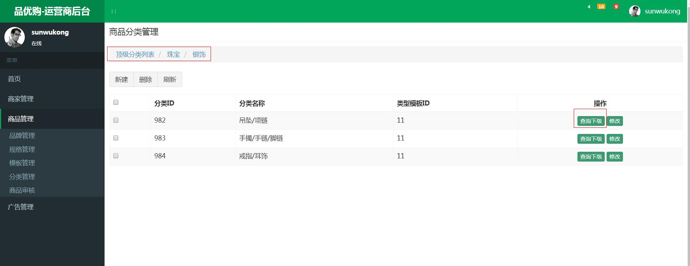
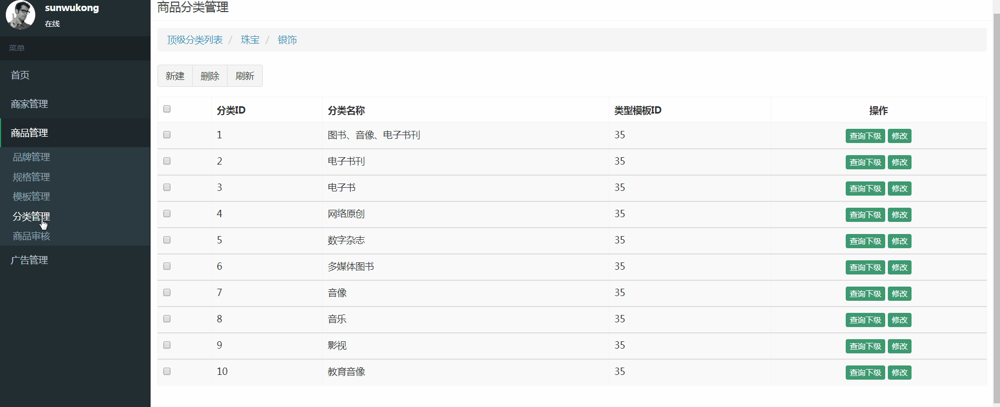
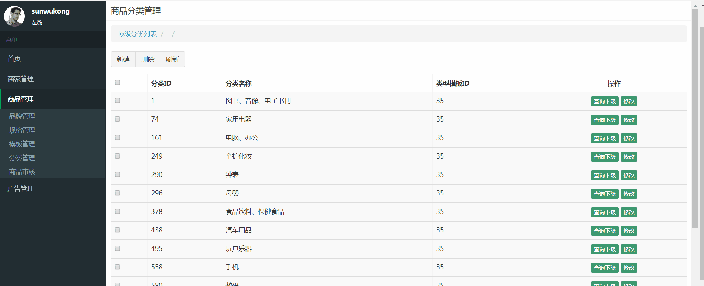

### 1、电商概念SKU与SPU

**SPU = Standard Product Unit** **（标准产品单位）**
 SPU是商品信息聚合的最小单位，是一组可复用、易检索的标准化信息的集合，该集合描述了一个产品的特性。
 通俗点讲，属性值、特性相同的商品就可以称为一个SPU。

例如：
 iphone7就是一个SPU，与商家，与颜色、款式、套餐都无关。

**SKU=stock keeping unit(库存量单位)**
 SKU即库存进出计量的单位， 可以是以件、盒、托盘等为单位。
 SKU是物理上不可分割的最小存货单元。在使用时要根据不同业态，不同管理模式来处理。在服装、鞋类商品中使用最多最普遍。

例如：
 纺织品中一个SKU通常表示：规格、颜色、款式。


### 2、实现三级商品分类列表查询功能




涉及到的数据库表tb_item_cat和tb_item：

```
CREATE TABLE `tb_item_cat` (
  `id` bigint(20) NOT NULL AUTO_INCREMENT COMMENT '类目ID',
  `parent_id` bigint(20) DEFAULT NULL COMMENT '父类目ID=0时，代表的是一级的类目',
  `name` varchar(50) DEFAULT NULL COMMENT '类目名称',
  `type_id` bigint(11) DEFAULT NULL COMMENT '类型id',
  PRIMARY KEY (`id`),
  KEY `parent_id` (`parent_id`)
) ENGINE=InnoDB AUTO_INCREMENT=1205 DEFAULT CHARSET=utf8 COMMENT='商品类目';
```

```
CREATE TABLE `tb_item` (
  `id` bigint(20) NOT NULL AUTO_INCREMENT COMMENT '商品id，同时也是商品编号',
  `title` varchar(100) NOT NULL COMMENT '商品标题',
  `sell_point` varchar(500) DEFAULT NULL COMMENT '商品卖点',
  `price` decimal(20,2) NOT NULL COMMENT '商品价格，单位为：元',
  `stock_count` int(10) DEFAULT NULL,
  `num` int(10) NOT NULL COMMENT '库存数量',
  `barcode` varchar(30) DEFAULT NULL COMMENT '商品条形码',
  `image` varchar(2000) DEFAULT NULL COMMENT '商品图片',
  `categoryId` bigint(10) NOT NULL COMMENT '所属类目，叶子类目',
  `status` varchar(1) NOT NULL COMMENT '商品状态，1-正常，2-下架，3-删除',
  `create_time` datetime NOT NULL COMMENT '创建时间',
  `update_time` datetime NOT NULL COMMENT '更新时间',
  `item_sn` varchar(30) DEFAULT NULL,
  `cost_pirce` decimal(10,2) DEFAULT NULL,
  `market_price` decimal(10,2) DEFAULT NULL,
  `is_default` varchar(1) DEFAULT NULL,
  `goods_id` bigint(20) DEFAULT NULL,
  `seller_id` varchar(30) DEFAULT NULL,
  `cart_thumbnail` varchar(150) DEFAULT NULL,
  `category` varchar(200) DEFAULT NULL,
  `brand` varchar(100) DEFAULT NULL,
  `spec` varchar(200) DEFAULT NULL,
  `seller` varchar(200) DEFAULT NULL,
  PRIMARY KEY (`id`),
  KEY `cid` (`categoryId`),
  KEY `status` (`status`),
  KEY `updated` (`update_time`)
) ENGINE=InnoDB AUTO_INCREMENT=1369284 DEFAULT CHARSET=utf8 COMMENT='商品表';
```

树状结构，异步加载，类似easyui里面的datagridTreeNode

ItemCatService接口，新增方法定义 ：

```
public List<TbItemCat> findByParentId(Long parentId); 
```

ItemCatServiceImpl ，实现方法 ：

```
@Override
	public List<TbItemCat> findByParentId(Long parentId) {		
		TbItemCatExample example1=new TbItemCatExample();
		Criteria criteria1 = example1.createCriteria();
		criteria1.andParentIdEqualTo(parentId);
		return  itemCatMapper.selectByExample(example1);		
	}
```

ItemCatController，增加控制器

```
@RequestMapping("/findByParentId")
	public List<TbItemCat> findByParentId(Long parentId){				
		return itemCatService.findByParentId(parentId);
	}
```

前端修改itemCatService.js:

```
//根据上级ID查询下级列表
	this.findByParentId=function(parentId){
		return $http.get('../itemCat/findByParentId.do?parentId='+parentId);	
	}
```

前端itemCatController.js:

```
    //根据上级ID显示下级列表 
	$scope.findByParentId=function(parentId){
		itemCatService.findByParentId(parentId).success(
			function(response){
				$scope.list=response;
			}			
		);
	}   
```

前端页面引入angular绑定数据：

```
//注意引入顺序
<script type="text/javascript" src="../plugins/angularjs/angular.min.js">  </script>
<script type="text/javascript" src="../js/base.js">  </script>
<script type="text/javascript" src="../js/service/itemCatService.js">  </script>
<script type="text/javascript" src="../js/controller/baseController.js">  </script>
<script type="text/javascript" src="../js/controller/itemCatController.js">  </script>

//body绑定angular app 和controller，给定初始化方法
<body class="hold-transition skin-red sidebar-mini" ng-app="pinyougou" ng-controller="itemCatController" ng-init="findByParentId(0)">


//table 部分绑定数据显示列表
 <tr ng-repeat="entity in list">
		<td><input type="checkbox" ></td>			                         
		<td>{{entity.id}}</td>
		<td>{{entity.name}}</td>									    
		<td>{{entity.typeId}}</td>									      
		<td class="text-center">		                                     
		<button type="button" class="btn bg-olive btn-xs" ng-click="findByParentId(entity.id)">查询下级</button> 		                     
		<button type="button" class="btn bg-olive btn-xs" data-toggle="modal" data-target="#editModal" >修改</button>                                          
	</td>
</tr>		

```

效果图：



再调整一下面包屑导航：



修改itemCatController.js :

```
	$scope.grade=1;//默认为1级	
	//设置级别
	$scope.setGrade=function(value){
		$scope.grade=value;
	}		
	//读取列表 一级分类实体 二级分类实体
	$scope.selectList=function(p_entity){			
		if($scope.grade==1){//如果为1级
			$scope.entity_1=null;	
			$scope.entity_2=null;
		}		
		if($scope.grade==2){//如果为2级
			$scope.entity_1=p_entity;	
			$scope.entity_2=null;
		}		
		if($scope.grade==3){//如果为3级
			$scope.entity_2=p_entity;		
		}		
		
		$scope.findByParentId(p_entity.id);	//查询此级下级列表
	}

```

修改列表的查询下级按钮，设定级别值后 显示列表 

```
<span ng-if="grade!=3">	                                     
<button type="button" class="btn bg-olive btn-xs" ng-click="setGrade(grade+1);selectList(entity)">查询下级</button> 		          </span>                                  	
```

绑定面包屑：

```
<ol class="breadcrumb">	                        	
  <li><a href="#" ng-click="grade=1;selectList({id:0})">顶级分类列表</a></li>
  <li><a href="#" ng-click="grade=2;selectList(entity_1)">{{entity_1.name}}</a></li>
  <li><a href="#" ng-click="grade=3;selectList(entity_2)">{{entity_2.name}}</a></li>
</ol>

```

