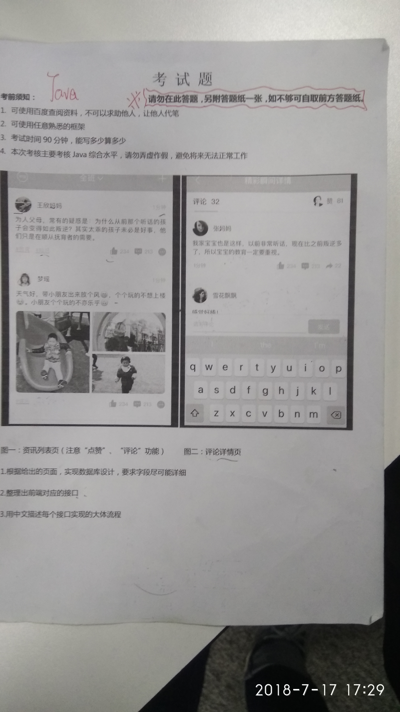

### 1、App后台面试

#### 7.17 周二，面试一家app公司，雀科。

##### 1、笔试题：可以百度，美滋滋

画类图，按功能写接口就好了。

##### 2、面试（1小时）

**介绍一下自己？**（学历、专业、为什么转Java、项目是上线的还是？）

..本科喜欢安卓，后来感觉是前端，不是自己想做的，转Java

..开源项目，无法上线

**接着问 为什么无法上线？**

分布式架构，十多个模块，没有服务器部署，做了伪分布式处理。

**秒杀系统介绍下，怎么做的，有哪些问题？库存怎么处理？多人同时下订单怎么保证安全性？**（尽量拦截上游请求、数据，按钮置灰、js5秒只能请求一次、）

**负载均衡怎么实现的？**（DNS轮询、nginx反向代理、服务连接池、数据库主从）

**SSO系统讲解下？**（为什么做单点、token机制、CAS单点流程）

**SpringSecurity懂吗？介绍下？**（安全框架，配合CAS）

**SolrCloud集群是你自己搭的吗？怎么搭的？为什么要搭集群？单个solr会不会搭？中文分词器原理？后台怎么操作的？**（zookeeper集群、solr集群，说了solr架构,逻辑collection、物理core，分片，过滤规则，后台solrJ操作，setXX高亮.....没回答上分词器）

**商品金额用什么类型，遇到过精度问题吗？**（答成float...按分计算）

**Redis数据类型有哪些？**

**hibernate缓存机制？**（忘了，没复习hibernate）

**springMVC处理请求流程**？（dispatcherServlet-handler处理器适配器——处理器映射器...modelandView——视图解析器）

**hashmap和hashtable区别？**（安全问题，对象锁，读写都锁，高并发性能差）

**多线程了解吗，sleep和wait有啥区别？**（锁、自身流程和线程间通信）

90%的回答上了，谈待遇要了 10K，等通知

#### 7.17周一下午  小公司 web后台

进去先做卷子，卷子题目做错了的如下？

##### valitale和atomic区别？（atomic没答上）

**Integer缓存范围？为什么？**

**ThreadLocal变量？**

面试说基础概念挺强，**问项目是否上线？为什么做这个？之后就没问技术了。**

工资要了9K，巴啦啦介绍了一堆他们的项目，我来的话有大牛带，学生的话没法上社保，还说我要高了，两边都得商量下。

感觉这公司想找7-8k的。

