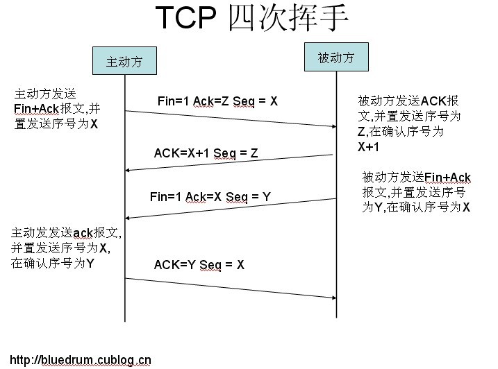

### 一、多线程、并发

####  1、进程的3种基本状态？

 

就绪态：已获得除cpu以外的所有资源，分配处理机就能立刻执行。

执行态：当前进程已经获得处理机。

阻塞态：正在执行的进程等待某个事件发生而放弃处理机

#### 2.sleep和wait区别？

sleep使线程停止一段时间，时间间隔期满后醒来不一定立即恢复执行，用于线程控制自身流程，**不会释放锁**。

wait用于线程通信，会使当前拥有该对象锁的进程等待，直到其他进程调用notify方法才醒来。

#### 3、多线程的实现方法？

1、实现runnable接口，实现该接口的run方法

2、继承Thread类，重写run方法

3、实现callable接口，重写call()方法。（功能更强大，带返回值）

#### 4、volatile、atomic关键字？

​	Java编译器会把经常访问的变量缓存起来，读取变量的时候会从寄存器中取读取，而不是从内存中。再多线程环境下，可能会造成读取到的值和实际的变量值不一致。用volatile修饰的变量，每次都会从内存中读取。volatile能保证变量的所有写操作都能立即反映到其他线程中，但他**不能保证操作的原子性，不是线程安全的**。举例：**读和写操作改成一个自增操作，这个自增操作是不是原子** 。包含读、加、写3个操作。对于int类型来说，java保证这里面的读和写操作中是原子的，但不保证它们加在一起仍然是原子的。 **合理运用valitale关键字，会很好的提升性能。**

​	volatile与加锁机制的主要区别是：加锁机制既可以确保可见性又可以确保原子性，而volatile变量只有确保可见性。 AtomicInteger内部通过了JNI的方式使用了硬件支持的**CAS指令**。Java.util.concurrent.atomic包 

​	著名的CAS（compare and set）接口。 java.util.concurrent包有不少数据结构被使用CAS优化，其中最著名的就是ConcurrentHashMap。 

#### 5、CAS与ABA问题

 ABA问题的描述如下：

>  1. 进程P1在共享变量中读到值为A
>  2. P1被抢占，进程P2获得CPU时间片并执行
>  3. P2把共享变量里的值从A改成了B，再改回到A
>  4. P2被抢占，进程P1获得CPU时间片并执行
>  5. P1回来看到共享变量里的值没有被改变，继续按共享变量没有被改变的逻辑执行
>

​     显然，这很可能导致不可预料的错误。在java.util.concurrent.atomic包中，有一个**AtomicStampedReference**类，它提供了**一个带有Stamp字段的CAS接口**。 这个Stamp参数就相当于一个版本号，当版本号和变量的值均一致的时候才允许更新变量。我们试着用这个方法解决ABA问题

#### 6、synchronized和Lock接口的区别

锁类型

- 可重入锁：在执行对象中所有同步方法不用再次获得锁
- 可中断锁：在等待获取锁过程中可中断
- 公平锁： 按**等待获取锁的线程的等待时间**进行获取，等待时间长的具有优先获取锁权利
- 读写锁：**对资源读取和写入的时候拆分为2部分处理**，读的时候可以多线程一起读，写的时候必须同步地写

synchronized缺陷：

- 不能响应中断；
- 同一时刻不管是读还是写都只能有一个线程对共享资源操作，其他线程只能等待
- 锁的释放由虚拟机来完成，优点是**不用担心会造成死锁**，缺点是由可能获取到锁的线程阻塞之后其他线程会一直等待，性能不高。

**ReentrantLock** 

​	在资源竞争不激烈的情形下，性能稍差。但是当同步非常激烈的时候，synchronized的性能一下子能下降好几十倍。而ReentrantLock确还能维持常态。 

| 类别     | synchronized                                                 | Lock                                                         |
| -------- | ------------------------------------------------------------ | ------------------------------------------------------------ |
| 存在层次 | Java的关键字，在jvm层面上                                    | 是一个接口，jdk层面                                          |
| 锁的释放 | 1、以获取锁的线程执行完同步代码，释放锁 2、线程执行发生异常，jvm会让线程释放锁 | **手动释放**，在finally中必须释放锁，不然容易造成线程死锁    |
| 锁的获取 | 假设A线程获得锁，B线程等待。如果A线程阻塞，B线程会一直等待   | 分情况而定，Lock有多个锁获取的方式，具体下面会说道，大致就是可以尝试获得锁，线程可以不用一直等待 |
| 锁状态   | 无法判断                                                     | 可以判断                                                     |
| 锁类型   | 可重入 不可中断 非公平                                       | 可重入 可判断 可公平（两者皆可）                             |
| 性能     | 少量同步                                                     | 大量同步                                                     |

#### 7、乐观锁与悲观锁，及应用场景？

乐观锁：每次操作数据之前都不加锁，更新的时候会判断一下在此期间有没有其他人更新数据。**无法解决脏读的问题，适用于多读的场景**

悲观锁：每次操作数据都加锁。**适用于并发量不大且不允许脏读场景下。**

#### 10、TCP三次握手、四次挥手？

> 为了解决网络中存在延迟的重复分组的问题 。
>
> 
>
> 第一次握手：建立连接时，**客户端发送syn包（syn=j）到服务器，并进入SYN_SENT状态**，等待服务器确认；SYN：同步序列编号（Synchronize Sequence Numbers）。
>
> 第二次握手：**服务器收到syn包，必须确认客户的SYN（ack=j+1），同时自己也发送一个SYN包（syn=k），即SYN+ACK包，此时服务器进入SYN_RECV状态**；
>
> 第三次握手：**客户端收到服务器的SYN+ACK包，向服务器发送确认包ACK(ack=k+1），此包发送完毕**，客户端和服务器进入ESTABLISHED（TCP连接成功）状态，完成三次握手。

> 第一步，当主机A的应用程序通知TCP数据已经发送完毕时，**TCP向主机B发送一个带有FIN附加标记的报文段**（FIN表示英文finish）。
>
> 第二步，**主机B收到这个FIN报文段之后**，并不立即用FIN报文段回复主机A，而是**先向主机A发送一个确认序号ACK，同时通知自己相应的应用程序：对方要求关闭连接**（先发送ACK的目的是为了防止在这段时间内，对方重传FIN报文段）。
>
> 第三步，主机B的应用程序告诉TCP：我要彻底的关闭连接，**TCP向主机A送一个FIN报文段。**
>
> 第四步，**主机A收到这个FIN报文段后，向主机B发送一个ACK表示连接彻底释放**。

#### 11、ThreadLocal与加锁同步机制

​	ThreadLocal是一个用于存放线程局部变量的容器。当使用ThreadLocal维护变量时，ThreadLocal为**每个使用该变量的线程提供独立的变量副本**，**所以每一个线程都可以独立地改变自己的副本，而不会影响其它线程所对应的副本。 因为线程不安全都是由全局变量引起的,  每个线程都有自己的副本变量， 相互之间不共享数据，线程安全** 。

​	ThreadLocal已经支持泛型，该类的类名已经变为ThreadLocal<T>   泛型的类型就是副本变量的数据类型。在ThreadLocal类中有一个Map，用于存储每一个线程的变量副本，Map中元素的键为线程对象，而值对应线程的变量副本。

​	对于多线程资源共享的问题，同步机制采用了“**以时间换空间**”的方式，而ThreadLocal采用了**“以空间换时间”**的方式。**前者仅提供一份变量，让不同的线程排队访问，而后者为每一个线程都提供了一份变量，因此可以同时访问而互不影响。** 

### 2、数据库及SQL语言

####1、存储过程和函数的区别？

存储过程是**一系列sql语句的集合，涉及特定的表或其他对象的任务，用户可以调用存储过程**。

函数是数据库已经定义的方法，**接收参数并返回值，不涉及特定的表**。

####2、什么事数据库事务？

数据库事务是指**单个的逻辑工作单元执行的一系列操作，要么全做，要么全做，是一个不可分割的工作单位**。具有**一致性，持久性，原子性和独立性**的特点。

一致性：事务运行不改变数据库中数据的一致性。

独立性：两个以上的事务不会出现交错执行的情况，这样可能会导致数据不一致。

持久性：事务运行成功，系统的更新是永久的，不会无缘无故回滚。

#### 3、数据量大的时候，如何提升查询效率？

**1、数据库设计方面**

​	建立索引、尽量使用固定长度的字段、限制字段长度

**2、数据库IO方面**

​	增加缓冲区，如果涉及表的级联，不同的表存在不同的磁盘上，增加IO速度

**3、sql语句**

​	减少比较次数，限制返回条目。

