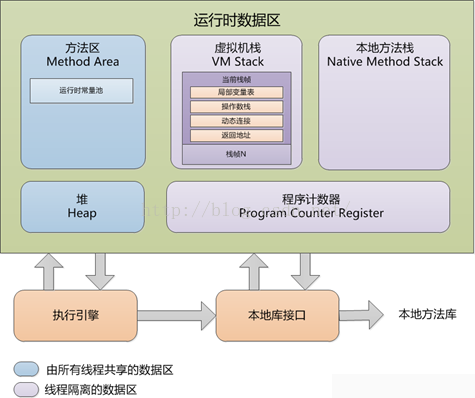
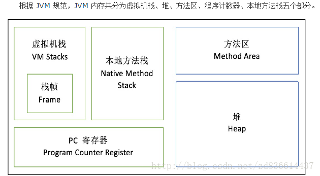
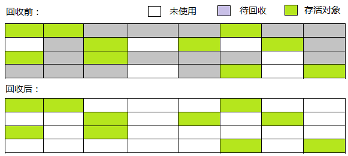
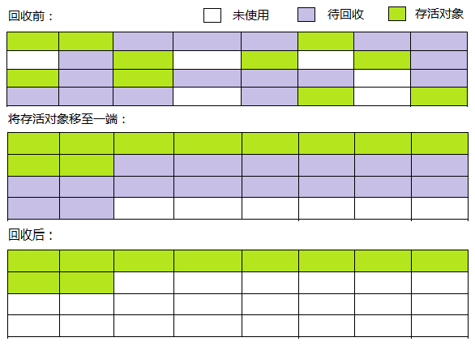

### 1.语法

#### 1、访问权限

**protected private不能修饰类**。

default private 修改类 ，数据成员，构造方法，方法成员。

private 同类使用

default 同包所有类

protected 类及其子类

public 所有包所有类

#### 2、面向对象（OOP）

一种“万物皆对象”的编程思想。**每一个要研究的事物都是一个对象，对同类事物抽象出其共性，形成类，而每一个个体都是这个类的实例**。对象=数据+操作方法。**面向对象的编程是以对象为中心，以消息为驱动**，所以程序=对象+消息 。

三大特性：继承、封装、多态

继承：代码复用。

封装：保护类的数据和方法，对外暴露接口，使用者不必了解具体的实现细节，就能通过特定的访问权限来使用类的成员 。

多态：实现接口重用 ，扩展类的功能，可扩展性和可维护性。（继承多态和接口多态）

**封装是为了对物与外界交流进行抽象。**

**继承是为了对物的信息进行抽象。**

**多态是为了对物的行为进行抽象。**

#### 3、Integer和int区别，integer的缓存策略？

int是基本数据类型，值传递，默认值为0,只能用来计算

Integer是包装对象，**引用传递，默认值为null**。

**往容器中存放整数的时候，里面装的都是对象，只能使用integer。**

**缓存机制：**（节省内存）

​	Integer类中的内部类InnerCache，是处理Integer的缓存，缓存数组的大小为256，static块中是对cache赋值从-128~127，在规定范围以内不会产生新的对象，直接返回缓存中的对象，不在范围内会产生新的对象，并且**Integer的缓存数据是不会被垃圾回收**。 

#### 4、final、finally、finali

final用来声明方法、属性和类，表示方法不可重写，属性不可变，类不可被继承。

finally作为异常处理的一部分，**只能用在try catch语句中，附带一个语句块，表示最终一定会被执行**，语句块中的return语句。当其中有return语句的时候会覆盖掉其他。

finalize是Object类的一个方法，在垃圾收集器执行的时候，**准备好释放对象占用的空间前**，调用其finalize（）方法，下一次垃圾回收动作发生的时候，真正回收对象占用的内存。

### 2、JVM篇

#### 1、JVM内存模型及分区

jvm分为堆区、虚拟机栈区、方法区、本地方法栈、PC。

- 方法区：主要是存储类信息，**运行时常量池**（静态常量和static变量），编译后的代码（字节码）等数据，**线程共享**。
- 堆：初始化的对象，成员变量 ，所有的**对象实例和数组都要在堆上分配空间，线程共享**
- 栈：栈的结构是栈帧组成的，调用方法就压栈，帧上面存储**局部变量表，操作数栈，方法出口**等信息，局部变量表存放的是8大基础类型和引用类型，所以还是一个指向地址的指针,**线程私有**。
- 本地方法栈：主要为**Native方法**服务
- 程序计数器：记录当前线程执行的行号

#### 2、类加载过程及原理，类的实例化顺序？

**加载、验证、准备、解析、初始化、**使用和卸载

> 1. 通过**全限定名来加载生成class对象到内存中**
> 2. 验证这个class文件，包括**文件格式校验、元数据验证，字节码校验**等。
> 3. 对这个对象**分配内存**。
> 4. 将**符号引用转化为直接引用**（指针引用）
> 5. 初始化就是开始执行构造器的代码。

**类的实例化顺序**

> 先静态、先父后子。 
> 先静态：父静态 > 子静态 
> 优先级：父类 > 子类       静态代码块 > 非静态代码块 > 构造函数 
>
> 一个类的实例化过程： 
> 1、父类中的static代码块，当前类的static 
> 2、顺序执行父类的普通代码块 
> 3、父类的构造函数 
> 4、子类普通代码块 
> 5、子类（当前类）的构造函数，按顺序执行。 
> 6、子类方法的执行，

#### 3、什么是类加载器，类加载器有哪些?

> 实现通过类的权限定名获取该类的二进制字节流的代码块叫做类加载器。
> 主要有一下四种类加载器:
>
> - 启动类加载器(**Bootstrap ClassLoader**):用来加载java核心类库，无法被java程序直接引用。
> - 扩展类加载器(**Extensions Classloader**):它用来加载 Java 的扩展库。
> - 系统类加载器（**System Classloader**）:它根据 Java 应用的类路径（CLASSPATH）来加载 Java 类。一般来说，Java 应用的类都是由它来完成加载的。可以通过 ClassLoader.getSystemClassLoader()来获取它。
> - 用户**自定义类加载器**，通过继承 java.lang.ClassLoader类的方式实现。

#### 4、类加载器双亲委派模型机制？

> Bootstrap ClassLoader、Extension ClassLoader、ApplicationClassLoader 
>
> 当一个类收到了类加载请求时，不会自己先去加载这个类，而是将其**委派**给父类，由父类去加载，如果此时父类不能加载，反馈给子类，由子类去完成类的加载。

#### 

#### 5、java垃圾回收机制及算法?

GC的三大任务：**分配内存、确保引用对象内存不被错误回收、回收不在引用的对象内存空间**

> ​	Java通过垃圾收集器技术来监控Java程序的运行，当对象不再使用的时候，自动释放对象所使用的内存。gc通过有向图记录和管理堆中所有的对象，所有不可达的对象都是可被回收的。

**对象存活算法：**

> **1、引用计数算法**
>
> ​	给对象添加一个引用计数器，被引用时计数器值+1，引用失效计数器值-1，当计数器值为0时对象不可能再被使用（实现简单，判断效率高，**未解决对象之间相互循环引用的问题**）。　
>
> **2、可达性分析算法**
>
> ​	将"GC Roots"对象作为起始节点，向下搜索，搜索走过的路径为引用链，当一个对象到GC Roots没有引用链时，则该对象是不可用的，**根顶点可达即为有效对象**。
>
> 可作为"GC Roots"的对象：
>
> - 方法区中静态属性引用的对象
> - 方法区中常量引用的对象
> - 虚拟机栈引用的对象 (栈帧中本地变量表)
> - 本地方法栈中JNI引用的对象 (Native方法)
>
>  

**垃圾回收算法**

> **1、标记-清除算法：**
>
> ​	先标记要回收的对象，然后统一回收，适用于**存活对象较多**的垃圾回收。 缺点是**效率低**， 标记和清除的过程效率不高，引发空间问题标记清除后**产生大量不连续的内存碎片**，给大对象分配内存时没有足够连续的内存空间，导致提前出发垃圾回收动作。
>
> 　　　　　　
>
> **2、复制算法**
>
> ​	将可用内存划分成相等大小两块，每次只使用其中一块，当这一块用完后将还存活的对象复制到另一块，然后将已使用过的内存一次清理。**存活对象较少**的垃圾回收，每次对整个半区进行内存回收，不用考虑内存碎片问题，只要移动堆顶指针，按顺序分配内存即可，实现简单，运行高效。缺点是内存缩小了一半
>
> **3、标记-整理算法**
>
> ​	先标记要回收的对象，将存活对象移至一端，最后清理端边界以外的内存。
>
> 　　　　　　
>
>  **4、分代收集算法**
>
> 　　根据对象存活周期将内存划分为**新生代和老年代**，然后根据每个年代的特点使用合适的回收算法；如：新生代存活对象少可以采用复制算法； 老年代存活对象多并且没有分配担保必须使用标记清理或标记整理回收算法。

#### 6、Minor GC与Full GC分别在什么时候发生？

> 新生代内存不够用时候发生MinorGC
>
> 调用System.gc()方法，老年代内存不足，永久代满（JDK8移除），时会触发FullGC

#### 7、JVM性能调优

> - **设定堆最小内存大小**-Xms
>
> 1. -Xmx：堆内存最大限制。
> 2. 设定新生代大小：新生代不宜太小，否则会有大量对象涌入老年代
>
> > -XX:NewSize：新生代大小
> >
> > -XX:NewRatio 新生代和老生代占比
> >
> > -XX:SurvivorRatio：Eden和Survivor区的占比
>
> - **设定垃圾回收器**
>
>   ​	年轻代用 -XX:+UseParNewGC （串行）  年老代用-XX:+UseConcMarkSweepGC （CMS）
>
> - **设定锁的使用**：多线程下关闭偏向锁，比较浪费资源

### 3、测试

#### 1、白盒、黑盒、灰盒测试？

- **黑盒测试：**已知产品的**功能设计规格**，可以进行测试证明每个实现了的功能是否符合要求。 
- **白盒测试：**已知产品的**内部工作过程**，可以通过测试证明每种内部操作是否符合设计规格要求，所有内部成分是否以经过检查。 
- **灰盒测试**：是介于白盒测试与黑盒测试之间的，灰盒测试**关注输出对于输入的正确性，同时也关注内部表现**，但这种关注不象白盒那样详细、完整，只 是通过一些表征性的现象、事件、标志来判断内部的运行状态，有时候输出是正确的，但内部其实已经错误了，这种情况非常多，如果每次都通过**白盒测试来操作， 效率会很低**，因此需要采取这样的一种灰盒的方法。 

#### 2、白盒测试方法？

**白盒测试主要是想对程序模块进行如下检查：** 
1、对程序模块的所有独立的**执行路径至少测试一遍。** 
2、对**所有的逻辑判定，取“真”与取“假”的两种情况都能至少测一遍**。 
3、在**循环的边界和运行的界限内执行循环体**。 
4、测试**内部数据结构的有效性**，等等。

**白盒测试方法：** 
1.代码检查法 
2.静态结构分析法 
3.静态质量度量法 
4.**逻辑覆盖法**（**语句覆盖（最弱）、判定覆盖、条件覆盖、判定/条件覆盖、条件组合覆盖和路径覆盖**） 
5.基本路径测试法 
6.域测试 
7.符号测试 
8.Z路径覆盖 
9.程序变异 
以上事实说明，软件测试有一个致命的缺陷，即**测试的不完全、不彻底性**。由于任何程序只能进行少量（相对于穷举的巨大数量而言）的有限的测试，在未发现错误时，不能说明程序中没有错误。

#### 3、测试的基本概念、测试结束准则、测试计划的设计

**功能测试**：黑盒测试，验证产品是否符合需求

**可用性测试**：由用户测试产品的易用性，包括有效性、效率、满意度

**测试结束准则**：BUG验证率95%以上，并且没有重大影响功能的bug 处于未解决状态，即可测试通过。 

**测试计划**：

- 根据产品特点和功能模块，列出需要测试的功能点，标明侧重点
- 测试策略和记录，包括测试用例等文档模板，测试方法的确定
- 测试资源配置，确定每一阶段的任务和所需资源

#### 4、性能测试的相关概念

**边界测试**：找到边界，在边界及其两侧选点。

**健壮性测试**：除了变量的5个边界值分析之外，还要分析变量值比最高值高出一点和最低值低出一点的情况下会出现什么反应。

**最坏情况测试**：对每个变量进行包含5个边界值元素集合的测试，然后对这些集合进行笛卡尔积计算，生成测试用例。

**特殊值测试**

**随机测试**：根据程序随机获取测试用例，注意覆盖率。

