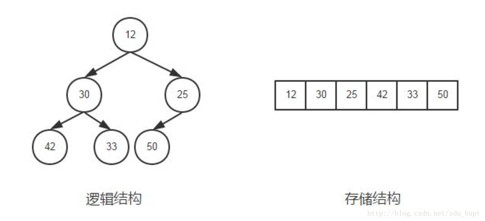

### 1、集合框架

#### 1、集合框架结构，数组与集合的关系？

 

数组：是用来存现对象的一种容器，**可以存储基本数据类型**，但是数组的**长度固定**，不适合在对象数量未知的情况下使用。

集合：**只能存储对象**，且对象类型可以不一样，**长度可变**，可在多数情况下使用。容器类仅能维持对象引用，而不是将对象信息复制一份至数列某位置。


**主要接口区别**

> 1、List（**有序、可重复**，**查询快，插入删除慢**）
> List里存放的对象是有序的，同时也是可以重复的，**List关注的是索引**，拥有一系列和索引相关的方法，查询速度快。因为往list集合里插入或删除数据时，会伴随着后面数据的移动，所以插入删除数据速度慢。
>
> 2、Set（**无序、不能重复**）
> Set里存放的对象是无序，不能重复的，集合中的对象不按特定的方式排序，只是简单地把对象加入集合中。
>
> 3、Map（**键值对、键唯一、值不唯一**）
> Map集合中存储的是键值对，键不能重复，值可以重复。根据键得到值，对map集合遍历时先得到键的set集合，对set集合进行遍历，得到相应的值。

**LinkedList类** 、**ArrayList类** 、**Vector类** 

> - linkedList没有同步方法。如果多个线程同时访问一个List，则必须自己实现访问同步 。（**查询慢，增删快**，底层是实现是链表）
> - ArrayList也是非同步的,允许null,基于索引，内部由一个数组支持。（**查询快，增删慢**，底层实现是数组）
> - Vector类似ArrayList，但是**Vector是同步的**。由Vector创建的Iterator ，当一个Iterator被创建而且正在被使用，另一个线程改变了Vector的状态（例如，添加或删除了一些元素），这时调用Iterator的方法时将抛出ConcurrentModificationException，因此必须捕获该异常。 
> - Stack继承自Vector，实现一个后进先出的堆栈。 

**HashTable、HashMap、TreeMap、HashTree、ConcurrentHashMap**

> HashMap和Hashtable类似，不同之处在于**HashMap是非同步的，并且允许null，即null value和null key。** 
>
> HashTable**通过synchronized修饰方法**的方式来实现多线程同步，它的同步会锁住整个数组，高并发情况下性能极差。
>
> 在Map中**插入、删除和定位元素**这类操作，HashMap是最好的选择。然而。假如你须要对一个**有序的key集合进行遍历**，TreeMap是更好的选择。**HashTree用于维护其内元素的总排序状态**。 

> **ConcurrentHashMap**：在线程安全的基础上提供了更好的写并发能力，但同时降低了对读一致性的要求 ，设计上大量的利用了volatile，final，CAS等lock-free技术来减少锁竞争对于性能的影响。
>
> ​	采用**分段锁**的设计，只有在**同一个分段内才存在竞态关系，不同的分段锁之间没有锁竞争**。相比于对整个**Map加锁**的设计，分段锁大大的提高了高并发环境下的处理能力。但同时，由于不是对整个Map加锁，导致一些需要扫描整个Map的方法（如size(), containsValue()）需要使用特殊的实现，另外一些方法（如clear()）甚至放弃了对一致性的要求，所以是**弱一致性的**。

###  2、排序算法

#### 1、算法复杂度及稳定性


> 稳定的排序算法是：冒泡排序，直接插入排序，归并排序，基数排序，二叉树排序，计数排序。  
>
> 不稳定的排序算法：选择排序，快速排序，堆排序，希尔排序。 
>
> 面试中常见的算法： **快速排序>归并排序>堆排序>冒泡>插入>选择**

#### 2、常用排序算法实现

##### 1、快排

> ​	快速排序是目前在实践中非常高效的一种排序算法，它**不是稳定**的排序算法，平均时间复杂度为O(nlogn)，最差情况下复杂度为O(n^2)。
>
> **基本思想**：通过一趟排序将要排序的数据分割成独立的两部分，其中一部分的所有数据都比另外一部分的所有数据都要小，然后再按此方法对这两部分数据分别进行快速排序，整个排序过程可以**递归**进行，以此达到整个数据变成有序序列。 

```
public static void QuickSort(int[] a, int l, int r ) {
    if(l < r) {
        int p = partition(a, l, r);
        QuickSort(a, l, p-1);
        QuickSort(a, p+1, r);   
    }
}
private static int partition(int[] a, int l, int r) {
    int tmp = a[r];
    int p = l - 1;
    for(int i=l; i<r; i++) {
        if(a[i]< tmp) {
            p++;
            swap(a, i, p);
        }
    }
    swap(a, r, p+1);
    return p+1;
}
```

##### 2、归并排序

> ​	归并排序是**稳定**的排序算法，其时间复杂度为O(nlogn)，如果是使用链表的实现的话，空间复杂度可以达到O(1)，但如果是使用数组来存储数据的话，在归并的过程中，需要临时空间来存储归并好的数据，所以空间复杂度为O(n)。
>
> **工作原理**（假设序列共有n个元素）：将序列每相邻两个数字进行归并操作（merge)，形成floor(n/2)个序列，排序后每个序列包含两个元素
>
> 将上述序列再次归并，形成floor(n/4)个序列，每个序列包含四个元素
>
> 重复步骤2，直到所有元素排序完毕。

```
 public void mergeSort(int[] A, int l, int r) {
        if(l>=r) return; 
            int m = l + (r-l)/2;
            mergeSort(A,l,m);
            mergeSort(A,m+1,r);
            merge(A,l,m,r);

    }

    public void merge(int[] A, int l, int mid, int r) {
        int[] B = new int[A.length];
        int s = l;
        int m = mid+1;
        int k = l;//数组标志位
        while(s<=mid && m<=r) {
            if(A[s]<=A[m]) {
                B[k++] = A[s++];
            } else{
                B[k++] = A[m++];
            }
        }
        while(s<=mid) {
            B[k++] = A[s++];
        }
        while(m<=r) {
            B[k++] = A[m++];
        }

        for(int i=l;i<=r;i++) {
            A[i] = B[i];
        }
    }
```


##### 3、堆排序

**二叉堆**是完全二叉树或者近似完全二叉树，满足两个特性 

> 1. 父结点的键值总是大于或等于(小于或等于)任何一个子节点的键值 
> 2. 每个结点的左子树和右子树都是一个二叉堆

当父结点的键值总是大于或等于任何一个子节点的键值时为**最大堆**。当父结点的键值总是小于或等于任何一个子节点的键值时为**最小堆**。一般二叉树简称为堆。

​	一般都是数组来存储堆，i结点的父结点下标就为(i – 1) / 2。它的左右子结点下标分别为2 * i + 1和2 * i + 2。如第0个结点左右子结点下标分别为1和2。存储结构如图所示：



> **算法原理** 
>
> 1. 先将初始数据R[1..n]建成一个最大堆，此堆为初始的无序区
> 2. 再将关键字最大的记录R[1]（即堆顶）和无序区的最后一个记录
> 3. R[n]交换，由此得到新的无序区R[1..n-1]和有序区R[n]，且满足R[1..n-1].keys≤R[n].key
> 4. 由于交换后新的根R[1]可能违反堆性质，故应将当前无序区R[1..n-1]调整为堆。
> 5. 重复2、3步骤，直到无序区只有一个元素为止。

```
   /**
 * 将数组arr构建大根堆
 * @param arr 待调整的数组
 * @param i   待调整的数组元素的下标
 * @param len 数组的长度
 */
public void heap_adjust(int arr[], int i, int len)
{
    int child;
    int temp;

    for (; 2 * i + 1 < len; i = child)
    {
        child = 2 * i + 1;  // 子结点的位置 = 2 * 父结点的位置 + 1
        // 得到子结点中键值较大的结点
        if (child < len - 1 && arr[child + 1] > arr[child])
            child ++;
        // 如果较大的子结点大于父结点那么把较大的子结点往上移动，替换它的父结点
        if (arr[i] < arr[child])
        {
            temp = arr[i];
            arr[i] = arr[child];
            arr[child] = temp;
        }
        else
            break;
    }
}

/**
 * 堆排序算法
 */
 public void heap_sort(int arr[], int len)
{
    int i;
    // 调整序列的前半部分元素，调整完之后第一个元素是序列的最大的元素
    for (int i = len / 2 - 1; i >= 0; i--)
    {
        heap_adjust(arr, i, len);
    }

    for (i = len - 1; i > 0; i--)
    {
        // 将第1个元素与当前最后一个元素交换，保证当前的最后一个位置的元素都是现在的这个序列中最大的
        int temp = arr[0];
        arr[0] = arr[i];
        arr[i] = temp;
        // 不断缩小调整heap的范围，每一次调整完毕保证第一个元素是当前序列的最大值
        heap_adjust(arr, 0, i);
    }
}
```

##### 4、冒泡排序

> **算法原理** 
> 	相邻的数据进行两两比较，小数放在前面，大数放在后面，这样一趟下来，最小的数就被排在了第一位，第二趟也是如此，如此类推，直到所有的数据排序完成。

```
    public void bubbleSort(int[] A) {
        int len = A.length;
        for(int i=0; i<len; i++) {
            for(int j=len-1; j>i; j--) {
                if(A[i]>A[j]){
                    int tmp = A[i];
                    A[i] = A[j];
                    A[j] = tmp;
                }
            }
        }
    }123456789101112
```

##### 5、插入排序

> **算法原理**
> 	将数据分为两部分，有序部分与无序部分，一开始有序部分包含第1个元素，依次将无序的元素插入到有序部分，直到所有元素有序。插入排序又分为直接插入排序、二分插入排序、链表插入等，这里只讨论直接插入排序。它是稳定的排序算法，时间复杂度为O(n^2)。

```
    public void insertSort(int[] A) {
        int len = A.length;
        int j;
        for(int i=0;i<len;i++){
            int tmp = A[i];
            for(j = i; j > 0 && tmp < A[j-1]; j--)   
                A[j] = A[j-1];   
            A[j] = tmp;
        }
    }12345678910
```

##### 6、 选择排序

> **算法原理** 
> 	先在未排序序列中找到最小（大）元素，存放到排序序列的起始位置，然后，再从剩余未排序元素中继续寻找最小（大）元素，然后放到已排序序列的末尾。以此类推，直到所有元素均排序完毕。

```
void select_sort(int arr[], int len)
  {
      for (int i = 0; i < len; i++)
      {
          int index = i;
          for (int j = i + 1; j < len; j++)
          {
              if (arr[j] < arr[index])
                  index = j;
          }
          if (index != i)
          {
              int temp = arr[i];
              arr[i] = arr[index];
              arr[index] = temp; 
          }
      }
  }
```

### 3、常见数据结构Java实现

`原文地质：https://segmentfault.com/a/1190000009797159`


#### 1、数组

​	数组是相同数据类型的元素按一定顺序排列的集合，是一块连续的内存空间。数组的优点是：get和set操作时间上都是O(1)的，缺点是：add和remove操作时间上都是O(N)的。Java中，Array就是数组。

```
int[] ints = new int[10];
ints[0] = 5;//set
int a = ints[2];//get
int len = ints.length;//数组长度
```

#### 2、链表

> ​	链表是一种非连续、非顺序的结构，数据元素的逻辑顺序是通过链表中的指针链接次序实现的，链表由一系列结点组成。
>
> ​	链表的优点是：add和remove操作时间上都是O(1)的；缺点是：get和set操作时间上都是O(N)的，而且需要额外的空间存储指向其他数据地址的项。查找操作对于未排序的数组和链表时间上都是O(N)。
>
> ​	Java中，LinkedList 使用链表作为其基础实现。

```
LinkedList<String> linkedList = new LinkedList<>();
linkedList.add("addd");//add
linkedList.set(0,"s");//set，必须先保证 linkedList中已经有第0个元素
String s =  linkedList.get(0);//get
linkedList.contains("s");//查找
linkedList.remove("s");//删除

//以上方法也适用于ArrayList
```

#### 3、队列

> ​	队列是一种特殊的线性表，特殊之处在于它只允许在表的前端进行删除操作，而在表的后端进行插入操作，亦即所谓的先进先出（FIFO）。
>
> ​	Java中，LinkedList实现了Deque，可以做为双向队列（自然也可以用作单向队列）。另外PriorityQueue实现了带优先级的队列，亦即队列的每一个元素都有优先级，且元素按照优先级排序。

```
Deque<Integer> integerDeque = new LinkedList<>();
// 尾部入队，区别在于如果失败了
// add方法会抛出一个IllegalStateException异常，而offer方法返回false
integerDeque.offer(122);
integerDeque.add(122);
// 头部出队,区别在于如果失败了
// remove方法抛出一个NoSuchElementException异常，而poll方法返回false
int head = integerDeque.poll();//返回第一个元素，并在队列中删除
head = integerDeque.remove();//返回第一个元素，并在队列中删除
// 头部出队，区别在于如果失败了
// element方法抛出一个NoSuchElementException异常，而peek方法返回null。
head = integerDeque.peek();//返回第一个元素，不删除
head = integerDeque.element();//返回第一个元素，不删除
```

#### 4、栈

> ​	栈（stack）又名堆栈，它是一种运算受限的线性表。其限制是仅允许在表的一端进行插入和删除运算。这一端被称为栈顶，相对地，把另一端称为栈底。它体现了后进先出（LIFO）的特点。
>
> ​	Java中，Stack实现了这种特性，但是Stack也继承了Vector，所以具有线程安全线和效率低下两个特性，最新的JDK8中，推荐用Deque来实现栈，比如：

```
Deque<Integer> stack = new ArrayDeque<Integer>();
stack.push(12);//尾部入栈
stack.push(16);//尾部入栈
int tail = stack.pop();//尾部出栈，并删除该元素
tail = stack.peek();//尾部出栈，不删除该元素
```

#### 5、集合

> ​	集合是指具有某种特定性质的具体的或抽象的对象汇总成的集体，这些对象称为该集合的元素，其主要特性是元素不可重复。
>
> ​	在Java中，HashSet 体现了这种数据结构，而HashSet是在HashMap的基础上构建的。LinkedHashSet继承了HashSet，使用HashCode确定在集合中的位置，使用链表的方式确定位置，所以有顺序。TreeSet实现了SortedSet 接口，是排好序的集合（在TreeMap 基础之上构建），因此查找操作比普通的Hashset要快（log(N)）；插入操作要慢（log（N））,因为要维护有序。

```
HashSet<Integer> integerHashSet = new HashSet<>();
integerHashSet.add(12121);//添加
integerHashSet.contains(121);//是否包含
integerHashSet.size();//集合大小
integerHashSet.isEmpty();//是否为空
```

#### 6、散列表

> ​	散列表也叫哈希表，是根据关键键值(Key-value)进行访问的数据结构，它通过把关键码值映射到表中一个位置来访问记录，以加快查找的速度，这个映射函数叫做**散列函数**。
>
> ​	Java中HashMap实现了散列表，而Hashtable比它多了一个线程安全性，但是由于使用了全局锁导致其性能较低，所以现在一般用**ConcurrentHashMap**来实现线程安全的HashMap（类似的，以上的数据结构在最新的java.util.concurrent的包中几乎都有对应的高性能的线程安全的类）。**TreeMap**实现SortMap接口，能够把它保存的记录按照键排序。**LinkedHashMap保留了元素插入的顺序**。**WeakHashMap**是一种改进的HashMap，它对key实行“弱引用”，如果一个key不再被外部所引用，那么该key可以被GC回收，而**不需要我们手动删除**。

```
HashMap<Integer,String> hashMap = new HashMap<>();
hashMap.put(1,"asdsa");//添加
hashMap.get(1);//获得
hashMap.size();//元素个数
```

#### 7、树

> 树（tree）是包含n（n>0）个节点的有穷集合，其中：
>
> - 每个元素称为**节点**（node）；
> - 有一个特定的节点被称为**根节点或树根**（root）。
> - 除根节点之外的其余数据元素被分为m（m≥0）个互不相交的结合T1，T2，……Tm-1，其中每一个集合Ti（1<=i<=m）本身也是一棵树，被称作原树的**子树**（subtree）。
>
> ​	树这种数据结构在计算机世界中有广泛的应用，比如**操作系统中用到了红黑树，数据库用到了B+树，编译器中的语法树，内存管理用到了堆（本质上也是树）**，信息论中的哈夫曼编码等等等等。
>
> ​	在Java中**TreeSet和TreeMap**用到了树来排序（二分查找提高检索速度），不过一般都需要程序员自己去定义一个树的类，并实现相关性质，而没有现成的API。下面就用Java来实现各种常见的树。

##### 1、二叉树

> ​	二叉树是一种基础而且重要的数据结构，其**每个结点至多只有二棵子树，二叉树有左右子树之分，第i层至多有2^(i-1)个结点（i从1开始）；深度为k的二叉树至多有2^(k)-1)个结点，对任何一棵二叉树，如果其终端结点数为n0，度为2的结点数为n2，则n0=n2+1**。
>
> 二叉树的性质：
>
> 1. 在非空二叉树中，第i层的结点总数不超过2^(i-1), i>=1;
> 2. 深度为h的二叉树最多有2^h-1个结点(h>=1)，最少有h个结点;
> 3. 对于任意一棵二叉树，如果其叶结点数为N0，而度数为2的结点总数为N2，则N0=N2+1;
> 4. 具有n个结点的完全二叉树的深度为log2(n+1);
> 5. 有N个结点的完全二叉树各结点如果用顺序方式存储，则结点之间有如下关系：
>    若I为结点编号则 如果I>1，则其父结点的编号为I/2；
>    如果2I<=N，则其左儿子（即左子树的根结点）的编号为2I；若2I>N，则无左儿子；
>    如果2I+1<=N，则其右儿子的结点编号为2I+1；若2I+1>N，则无右儿子。
> 6. 给定N个节点，能构成h(N)种不同的二叉树，其中h(N)为卡特兰数的第N项，h(n)=C(2*n, n)/(n+1)。
> 7. 设有i个枝点，I为所有枝点的道路长度总和，J为叶的道路长度总和J=I+2i。

##### 2、满二叉树、完全二叉树

> ​	满二叉树：除最后一层无任何子节点外，**每一层上的所有结点都有两个子结点**；
>
> ​	完全二叉树：若设二叉树的深度为h，**除第 h 层外，其它各层 (1～(h-1)层) 的结点数都达到最大个数，第h层所有的结点都连续集中在最左边**，这就是完全二叉树；
>
> ​	满二叉树是完全二叉树的一个特例。

##### 3、二叉查找树

> ​	二叉查找树，又称为是**二叉排序树（Binary Sort Tree）或二叉搜索树**。二叉排序树或者是一棵空树，或者是具有下列性质的二叉树：
>
> 1. 若左子树不空，则左子树上所有结点的值均小于它的根结点的值；
> 2. 若右子树不空，则右子树上所有结点的值均大于或等于它的根结点的值；
> 3. 左、右子树也分别为二叉排序树；
> 4. 没有键值相等的节点。
>
> 　　二叉查找树的性质：对二叉查找树进行**中序遍历，即可得到有序的数列**。
> 　　二叉查找树的时间复杂度：它和二分查找一样，插入和查找的时间复杂度均为O(logn)，但是在最坏的情况下仍然会有O(n)的时间复杂度。原因在**于插入和删除元素的时候，树没有保持平衡。我们追求的是在最坏的情况下仍然有较好的时间复杂度**，这就是平衡二叉树设计的初衷。
>
> 二叉查找树可以这样**表示**：

```
public class BST<Key extends Comparable<Key>, Value> {
    private Node root;             // 根节点

    private class Node {
        private Key key;           // 排序的间
        private Value val;         // 相应的值
        private Node left, right;  // 左子树，右子树
        private int size;          // 以该节点为根的树包含节点数量

        public Node(Key key, Value val, int size) {
            this.key = key;
            this.val = val;
            this.size = size;
        }
    }
    public BST() {}
    
    public int size() {//获得该二叉树节点数量
        return size(root);
    }
    
    private int size(Node x) {获得以该节点为根的树包含节点数量
        if (x == null) return 0;
        else return x.size;
    }
}
```

**查找：**

```
public Value get(Key key) {
    return get(root, key);
}

private Value get(Node x, Key key) {//在以x节点为根的树中查找key
    if (x == null) return null;
    int cmp = key.compareTo(x.key);
    if      (cmp < 0) return get(x.left, key);//递归左子树查找
    else if (cmp > 0) return get(x.right, key);//递归右子树查找
    else              return x.val;//找到了
}
```

**插入：**

```
public void put(Key key, Value val) {
    root = put(root, key, val);
}

private Node put(Node x, Key key, Value val) {在以x节点为根的树中查找key，val
    if (x == null) return new Node(key, val, 1);
    int cmp = key.compareTo(x.key);
    if      (cmp < 0) x.left  = put(x.left,  key, val);//递归左子树插入
    else if (cmp > 0) x.right = put(x.right, key, val);//递归右子树插入
    else              x.val   = val;
    x.size = 1 + size(x.left) + size(x.right);
    return x;
}
```

**删除：**

```
public Key min() {
    return min(root).key;
} 
private Node min(Node x) { 
    if (x.left == null) return x; 
    else                return min(x.left); 
} 

public void deleteMin() {
    root = deleteMin(root);
}
private Node deleteMin(Node x) {//删除以x为根节点的子树最小值
    if (x.left == null) return x.right;
    x.left = deleteMin(x.left);
    x.size = size(x.left) + size(x.right) + 1;
    return x;
}

public void delete(Key key) {
     root = delete(root, key);
}
private Node delete(Node x, Key key) {
    if (x == null) return null;

    int cmp = key.compareTo(x.key);
    if      (cmp < 0) x.left  = delete(x.left,  key);//递归删除左子树
    else if (cmp > 0) x.right = delete(x.right, key);//递归删除右子树
    else { //该节点就是所要删除的节点
        if (x.right == null) return x.left;//没有右子树，把左子树挂在原节点父节点上
        if (x.left  == null) return x.right;//没有左子树，，把右子树挂在原节点父节点上
        Node t = x;//用右子树中最小的节点来替代被删除的节点，仍然保证树的有序性
        x = min(t.right);
        x.right = deleteMin(t.right);
        x.left = t.left;
    } 
    x.size = size(x.left) + size(x.right) + 1;
    return x;
} 
```

#####4、平衡二叉树

​	平衡二叉树又被称为AVL树，具有以下性质：它是一棵空树或它的左右两个子树的高度差的绝对值不超过1，并且左右两个子树都是一棵平衡二叉树。**它的出现就是解决二叉查找树不平衡导致查找效率退化为线性的问题，因为在删除和插入之时会维护树的平衡，使得查找时间保持在O(logn)，比二叉查找树更稳定**。

​	AVLTree 的 Node 由 BST 的 Node 加上 `private int height;` 节点高度属性即可，这是为了便于判断树是否平衡。维护树的平衡关键就在于**旋转**。对于一个平衡的节点，由于任意节点最多有两个儿子，因此高度不平衡时，此节点的两颗子树的高度差2。容易看出，这种不平衡出现在下面四种情况：


> 1. 6节点的左子树3节点高度比右子树7节点大2，左子树3节点的左子树1节点高度大于右子树4节点，这种情况成为左左。
> 2. 6节点的左子树2节点高度比右子树7节点大2，左子树2节点的左子树1节点高度小于右子树4节点，这种情况成为左右。
> 3. 2节点的左子树1节点高度比右子树5节点小2，右子树5节点的左子树3节点高度大于右子树6节点，这种情况成为右左。
> 4. 2节点的左子树1节点高度比右子树4节点小2，右子树4节点的左子树3节点高度小于右子树6节点，这种情况成为右右。

​	从图2中可以可以看出，1和4两种情况是对称的，这两种情况的旋转算法是一致的，只需要经过一次旋转就可以达到目标，我们称之为**单旋转**。2和3两种情况也是对称的，这两种情况的旋转算法也是一致的，需要进行两次旋转，我们称之为**双旋转**。

​	单旋转是针对于左左和右右这两种情况，这两种情况是对称的，只要解决了左左这种情况，右右就很好办了。图3是左左情况的解决方案，节点k2不满足平衡特性，因为它的左子树k1比右子树Z深2层，而且k1子树中，更深的一层的是k1的左子树X子树，所以属于左左情况。


​	为使**树恢复平衡**，我们把k1变成这棵树的根节点，因为k2大于k1，把k2置于k1的右子树上，而原本在k1右子树的Y大于k1，小于k2，就把Y置于k2的左子树上，这样既满足了二叉查找树的性质，又满足了平衡二叉树的性质。这样的操作只需要一部分指针改变，结果我们得到另外一颗二叉查找树，它是一棵AVL树，因为X向上一移动了一层，Y还停留在原来的层面上，Z向下移动了一层。整棵树的新高度和之前没有在左子树上插入的高度相同，插入操作使得X高度长高了。因此，由于这颗子树高度没有变化，所以通往根节点的路径就不需要继续旋转了。

代码：

```
private int height(Node t){  
    return t == null ? -1 : t.height;  
}     

//左左情况单旋转  
private Node rotateWithLeftChild(Node k2){  
    Node k1 = k2.left;  
    k2.left = k1.right;       
    k1.right = k2;        
    k1.size = k2.size;
    k2.size = size(k2.right)+size(k2.left)+1;
    k2.height = Math.max(height(k2.left), height(k2.right)) + 1;  
    k1.height = Math.max(height(k1.left), k2.height) + 1;         
    return k1;      //返回新的根  
}     
//右右情况单旋转  
private Node rotateWithRightChild(Node k2){  
    Node k1 = k2.right;  
    k2.right = k1.left;  
    k1.left = k2;  
    k1.size = k2.size;
    k2.size = size(k2.right)+size(k2.left)+1;       
    k2.height = Math.max(height(k2.left), height(k2.right)) + 1;  
    k1.height = Math.max(height(k1.right), k2.height) + 1;        
    return k1;      //返回新的根   
}     
```

> ​	双旋转是针对于左右和右左这两种情况，单旋转不能使它达到一个平衡状态，要经过两次旋转。同样的，这样两种情况也是对称的，只要解决了左右这种情况，右左就很好办了。图4是左右情况的解决方案，节点k3不满足平衡特性，因为它的左子树k1比右子树Z深2层，而且k1子树中，更深的一层的是k1的右子树k2子树，所以属于左右情况。


​	为使树恢复平衡，我们需要进行两步，第一步，把k1作为根，进行一次右右旋转，旋转之后就变成了左左情况，所以第二步再进行一次左左旋转，最后得到了一棵以k2为根的平衡二叉树。

```
//左右情况  
private Node doubleWithLeftChild(Node k3){        
    try{  
        k3.left = rotateWithRightChild(k3.left);  
    }catch(NullPointerException e){  
        System.out.println("k.left.right为："+k3.left.right);  
        throw e;  
    }  
    return rotateWithLeftChild(k3);       
}     
//右左情况  
private Node doubleWithRightChild(Node k3){  
    try{  
        k3.right = rotateWithLeftChild(k3.right);  
    }catch(NullPointerException e){  
        System.out.println("k.right.left为："+k3.right.left);  
        throw e;  
    }         
    return rotateWithRightChild(k3);  
}  
```

AVL查找操作与BST相同，AVL的删除与插入操作在BST基础之上**需要检查是否平衡**，如果不平衡就要使用旋转操作来维持平衡:

```
private Node balance(Node x) {
    if (balanceFactor(x) < -1) {//右边高
        if (balanceFactor(x.right) > 0) {//右左
            x.right = rotateWithLeftChild(x.right);
        }
        x = rotateWithRightChild(x);
    }
    else if (balanceFactor(x) > 1) {//左边高
        if (balanceFactor(x.left) < 0) {//左右
            x.left = rotateWithRightChild(x.left);
        }
        x = rotateWithLeftChild(x);
    }
    return x;
}

private int balanceFactor(Node x) {
    return height(x.left) - height(x.right);
}
```

#####5、堆

​	堆是一颗完全二叉树，在这棵树中，所有父节点都满足大于等于其子节点的堆叫**大根堆**，所有父节点都满足小于等于其子节点的堆叫**小根堆**。**堆虽然是一颗树，但是通常存放在一个数组中，父节点和孩子节点的父子关系通过数组下标来确定**。如下图的小根堆及存储它的数组：


值： 7,8,9,12,13,11

数组索引： 0,1,2,3, 4, 5

通过一个节点在数组中的索引怎么计算出它的父节点及左右孩子节点的索引：

```
public int left(int i) {
     return (i + 1) * 2 - 1;
}

public int right(int i) {
    return (i + 1) * 2;
}

public int parent(int i) {
    // i为根结点
    if (i == 0) {
        return -1;
    }
    return (i - 1) / 2;
}
```

维护大根堆的性质：

```
public void heapify(T[] a, int i, int heapLength) {
    int l = left(i);
    int r = right(i);
    int largest = -1;
    //寻找根节点及其左右子节点，三个元素中的最大值
    if (l < heapLength && a[i].compareTo(a[l]) < 0) {
        largest = l;
    } else {
        largest = i;
    }
    if (r < heapLength && a[largest].compareTo(a[r]) < 0) {
        largest = r;
    }
    
    // 如果i处元素不是最大的，就把i处的元素与最大处元素交换，使得i处元素变为最大的
    if (i != largest) {
        T temp = a[i];
        a[i] = a[largest];
        a[largest] = temp;
        // 交换元素后，以a[i]为根的树可能不在满足大根堆性质，于是递归调用该方法
        heapify(a, largest, heapLength);
    }
}
```

构造堆：

```
public  void buildHeap(T[] a, int heapLength) {
    //从后往前看lengthParent处的元素是第一个有子节点的元素，所以从它开始，进行堆得维护
    int lengthParent = parent(heapLength - 1);
    for(int i = lengthParent; i >= 0; i--){
        heapify(a, i, heapLength);
    }
}
```

堆的用途：堆排序，优先级队列。