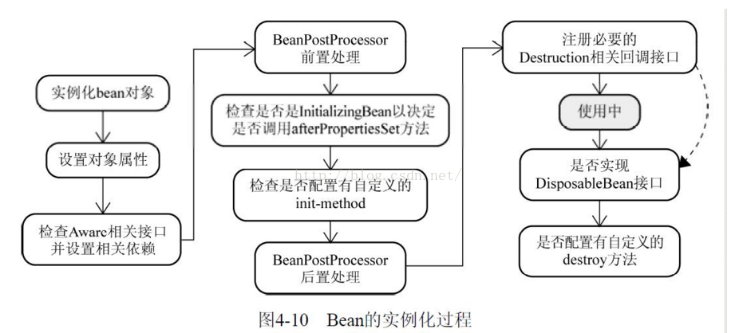
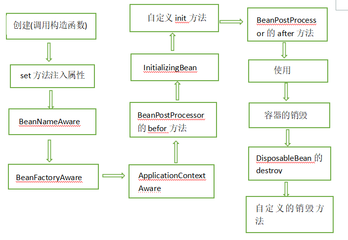
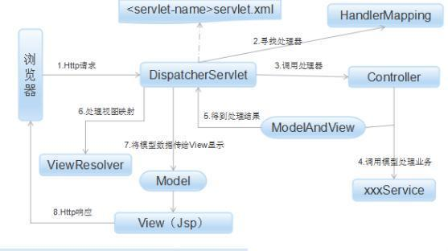
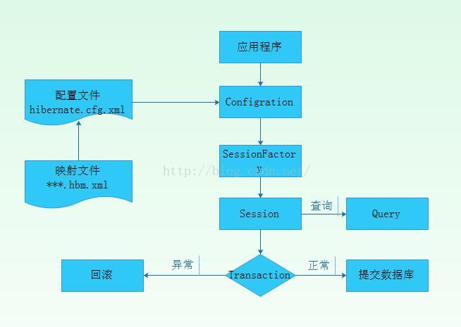

### spring篇

#### 1、spring的特点，为什么要使用spring，spring的理解

**特点**
##1、海量存储问题

- 
- spring主要提供了一种管理业务对象的方法。

**优势**

- **轻量：**轻量的，基本的版本大约2MB。

- **容器：**Spring 有效组织中间层对象，包含并管理应用中对象的生命周期和配置。

- **控制反转：**Spring通过控制反转实现了松散耦合，对象们给出它们的依赖，而不是创建或查找依赖的对象们。

- **面向切面的编程(AOP)：**Spring支持面向切面的编程，并且把应用业务逻辑和系统服务分开。

- **事务管理：**Spring 提供一个持续的事务管理接口，可以扩展到上至本地事务下至全局事务（JTA）。

- **测试**：spring构建的应用程序方便单元测试。

  

#### 2、spring有哪些模块，有哪些核心类？

​	主要有**七大模块**，spring AOP、spring ORM、spring DAO、spring Context、spring web MVC、spring Core等

​	事务管理支持、orm框架支持、JDBC支持、spring上下文环境、创建对象，实例化对象，生命周期管理。

**核心类：**

- BeanFactory：产生一个新的实例，可以实现单例模式 
  #### 7.17周一下午  小公司 web后台

- 
- ##### valitale和atomic区别？（atomic没答上）

  

  #### 3、spring IOC 和AOP的理解？

  ​	spring是一个轻量级的IOC容器和AOP框架。

  **AOP原理：**AOP是面向切面编程，是通过动态代理的方式为程序添加统一功能，集中解决一些公共问题。（比如异常处理）

  **优点：**1.各个步骤之间的良好隔离性耦合性大大降低 
             2.源代码无关性，再扩展功能的同时不对源码进行修改操作 

  

  **IOC作用与原理：**

  ​	当某个角色需要另外一个角色协助的时候，在传统的程序设计过程中，通常**由调用者来创建被调用者的实例对象**。但在spring中创建被调用者的工作不再由调用者来完成，因此称为控制反转。**创建被调用者的工作由spring来完成**，然后注入调用者 直接使用 （比如mapper等）。

  ​	org.springframework.beans包和 org.springframework.context包构成了Spring框架IoC容器的基础。bean包下的BeanFactory是Spring IoC容器的具体实现，用来包装和管理前面提到的各种bean，在配置文件中加以设定，就可以在运行期动态创建对象并设定其属性（依赖关系）。

  

  #### 4、对依赖注入、控制反转的理解？

  **依赖注入DI：**运行期由spring容器根据配置文件，将依赖关系注入到组件中。 

  **实现方式：**构造器注入、接口注入、setter方法注入

  

  ​	对象在被创建的时候，由一个调控系统内所有对象的外界实体，将其所依赖的对象的引用，传递给它。也可以说，依赖被注入到对象中。所 以，控制反转是，关于一个对象如何获取他所依赖的对象的引用，这个责任的反转。 

  

  5、用到的设计模式？

  - **简单工厂**（BeanFactory ）：简单工厂模式的实质是由一个工厂类根据传入的参数，动态决定应该创建哪一个产品类。  spring中的BeanFactory就是简单工厂模式的体现，根据传入一个唯一的标识来获得bean对象 

  - 

  - **单例模式**：提供了全局的访问点BeanFactory。但没有从构造器级别去控制单例 

  - **适配器**：生成被代理类的代理类， 并在代理类的方法前，设置拦截器，通过执行拦截器重的内容增强了代理方法的功能，实现的面向切面编程。 

  - **包装器**：sessionFactory在执行数据持久化的时候，根据客户的需求能够动态切换不同的数据源 。org.springframework.jndi.JndiObjectFactoryBean等。然后sessionFactory根据客户的每次请求，将dataSource属性设置成不同的数据源，以到达切换数据源的目的 

  - **代理**：为其他对象提供一种代理以控制对这个对象的访问 ，spring的Proxy模式在aop中有体现，比如JdkDynamicAopProxy和Cglib2AopProxy。   

  - **观察者**：定义对象间的一种一对多的依赖关系，当一个对象的状态发生改变时，所有依赖于它的对象都得到通知并被自动更新。 spring中Observer模式常用的地方是listener的实现。如ApplicationListener。   

  - **策略**：定义一系列的算法，把它们封装起来，并且使它们可相互替换。本模式使得算法可独立于使用它的客户而变化。  spring中在实例化对象的时候用到Strategy模式 在SimpleInstantiationStrategy 

  - **模板方法** ：Template Method使得子类可以不改变一个算法的结构即可重定义该算法的某些特定步骤。 。spring中的JdbcTemplate，在用这个类时并不想去继承这个类， execute方法 ，在这个回调对象中定义一个操纵JdbcTemplate中变量的方法，我们去实现这个方法，就把变化的东西集中到这里了。然后我们再传入这个回调对象到JdbcTemplate，从而完成了调用。 

    

  #### 6、spring bean的生命周期？

  

  

  - 1、**实例化一个Bean**－－也就是我们常说的new；
  - 2、按照Spring上下文对实例化的Bean进行配置－－也就是**IOC注入**；
  - 3、如果这个Bean已经实现了**BeanNameAware**接口，会调用它实现的setBeanName(String)方法，此处**传递**的就是Spring配置文件中**Bean的id值**
  - 4、如果这个Bean已经实现了**BeanFactoryAware**接口，会调用它实现的setBeanFactory(setBeanFactory(BeanFactory)**传递的是Spring工厂自身**（可以用这个方式来获取其它Bean，只需在Spring配置文件中配置一个普通的Bean就可以）。
  - 5、如果这个Bean已经实现了**ApplicationContextAware**接口，会调用setApplicationContext(ApplicationContext)方法，**传入Spring上下文**（同样这个方式也可以实现步骤4的内容，但比4更好，因为ApplicationContext是BeanFactory的子接口，有更多的实现方法）；
  - 6、**前置处理**：如果这个Bean关联了**BeanPostProcessor**接口，将会调用postProcessBeforeInitialization(Object obj, String s)方法，BeanPostProcessor经常被用作是**Bean内容的更改**，并且由于这个是在Bean初始化结束时调用那个的方法，也可以被应用于内存或缓存技术；
  -  7、如果Bean在Spring配置文件中配置了init-method属性会自动调用其配置的**初始化**方法。
  - 8、**后置处理**：如果这个Bean关联了BeanPostProcessor接口，将会调用postProcessAfterInitialization(Object obj, String s)方法；

  ​    注：以上工作完成以后就可以应用这个Bean了，那这个Bean是一个Singleton的，所以一般情况下我们调用同一个id的Bean会是在内容地址相同的实例，当然在Spring配置文件中也可以配置非Singleton，这里我们不做赘述。

  9、**销毁**：当Bean不再需要时，会经过清理阶段，如果Bean实现了**DisposableBean**这个接口，会调用那个其实现的destroy()方法；

   10、**自定义销毁**：最后，如果这个Bean的Spring配置中配置了**destroy-method属性**，会自动调用其配置的销毁方法。

  

  #### 7、Bean 工厂和 Application contexts  有什么区别？

  1. BeanFactory负责读取bean配置文档，管理bean的加载，实例化，维护bean之间的依赖关系，负责bean的生命周期。

  2. a. 国际化支持
     b. **资源访问**：Resource rs = ctx. getResource(”classpath:config.properties”), “file:c:/config.properties”
     c. **事件传递**：通过实现ApplicationContextAware接口

  #### 8、Spring Bean的作用域之间有什么区别？

  Spring容器中的bean可以分为5个范围。所有范围的名称都是自说明的。

  **singleton**：这种bean范围是默认的，这种范围确保不管接受到多少个请求，每个容器中只有一个bean的实例，单例的模式由bean factory自身来维护。

  **prototype**：原形范围与单例范围相反，为每一个bean请求提供一个实例。

  **request**：在请求bean范围内会每一个来自客户端的网络请求创建一个实例，在请求完成以后，bean会失效并被垃圾回收器回收。

  **Session**：与请求范围类似，确保每个session中有一个bean的实例，在session过期后，bean会随之失效。

  **global-session**：global-session和Portlet应用相关。当你的应用部署在Portlet容器中工作时，它包含很多portlet。如果你想要声明让所有的portlet共用全局的存储变量的话，那么这全局变量需要存储在global-session中。

  全局作用域与Servlet中的session作用域效果相同。

  #### 9、S**pring管理事务有几种方式？**

  答：有两种方式：

  1、编程式事务，在代码中硬编码。(不推荐使用)

  2、声明式事务，在配置文件中配置（推荐使用）

  声明式事务又分为两种：

  a、基于XML的声明式事务

  b、基于注解的声明式事务

  #### 10、s**pring中自动装配的方式有哪些？**

  答：1、 No：即不启用自动装配。

  2、 **byName**：通过属性的名字的方式查找JavaBean依赖的对象并为其注入。比如说类Computer有个属性printer，指定其autowire属性为byName后，Spring IoC容器会在配置文件中查找id/name属性为printer的bean，然后使用Seter方法为其注入。

  3、 **byType**：通过属性的类型查找JavaBean依赖的对象并为其注入。比如类Computer有个属性printer，类型为Printer，那么，指定其autowire属性为byType后，Spring IoC容器会查找Class属性为Printer的bean，使用Seter方法为其注入。

  4、 **constructor**：通byType一样，也是通过类型查找依赖对象。与byType的区别在于它不是使用Seter方法注入，而是使用构造子注入。

  5、 **autodetect**：在byType和constructor之间自动的选择注入方式。

  6、 **default**：由上级标签<beans>的default-autowire属性确定。

  

  ### springMVC篇

  #### 1、springMVC的流程？

  

  答：1.用户发送请求至**前端控制器DispatcherServlet**

  2.DispatcherServlet收到请求调用**HandlerMapping处理器映射器**。

  3.处理器映射器根据请求url找到具体的处理器，生成处理器对象及处理器拦截器(如果有则生成)一并返回给DispatcherServlet。

  4.DispatcherServlet通过**HandlerAdapter处理器适配器**调用处理器

  5.执行处理器(Controller，也叫**后端控制器**)。

  6.Controller执行完成**返回ModelAndView**

  7.HandlerAdapter将controller执行结果ModelAndView返回给DispatcherServlet

  8.**DispatcherServlet将ModelAndView传给ViewReslover视图解析器**

  9.**ViewReslover解析后返回具体View**

  10.DispatcherServlet对View进行**渲染视图**（即将模型数据填充至视图中）。

  11.DispatcherServlet响应用户

  #### 2、Springmvc的优点

  答：1.它是基于组件技术的.全部的应用对象,无论控制器和视图,还是业务对象之类的都是 java组件.并且和Spring提供的其他基础结构紧密集成.

  2.不依赖于Servlet API(目标虽是如此,但是在实现的时候确实是依赖于Servlet的)

  3. 可以任意使用各种视图技术,而不仅仅局限于JSP

  4 . 支持各种请求资源的映射策略

  5 .它应是易于扩展的

  

  ### Hibernate篇

  #### 1、hibernate的运行原理,为什么要用？

  1. Configration 类读取并解析配置文件

  2. 读取并解析映射信息，创建SessionFactory

  3. 打开session

  4. 创建事务

  5. 持久化操作

  6. 提交事务

  7. 关闭session

  8. 关闭SessionFactory

     **为什么要用**

     ① . 对JDBC访问数据库的代码做了封装，大大简化了数据访问层繁琐的重复性代码。

     ② . Hibernate是一个基于JDBC的主流持久化框架，是一个优秀的ORM实现。他很大程度的简化DAO层的编码工作

     ③ . hibernate使用Java反射机制，而不是字节码增强程序来实现透明性。
     #### 4、性能测试的相关概念

     ④ . hibernate的性能非常好，因为它是个轻量级框架。映射的灵活性很出色。它支持各种关系数据库，从一对一到多对多的各种复杂关系。

  #### 2、hibernate的二级缓存机制？

  ​	1、Hibernate一级缓存又称为“Session的缓存”，是必须的。由于Session对象的生命周期通常对应一个数据库事务或者一个应用事务，因此它的缓存是**事务范围的缓存**。在第一级缓存中，持久化类的每个实例都具有唯一的OID。 

  ​	2、Hibernate二级缓存又称为“SessionFactory的缓存”，由于SessionFactory对象的生命周期和应用程序的整个过程对应，因此**Hibernate二级缓存是进程范围或者集群范围的缓存，有可能出现并发问题**，因此需要采用适当的并发访问策略，该策略为被缓存的数据提供了事务隔离级别。第二级缓存是非必须的，是一个可配置的插件。 

  ​	当Hibernate根据ID访问数据对象的时候，**首先从Session一级缓存中查；查不到，如果配置了二级缓存，那么从二级缓存中查；如果都查不到，再查询数据库**，把结果按照ID放入到缓存删除、更新、增加数据的时候，同时更新缓存。 

