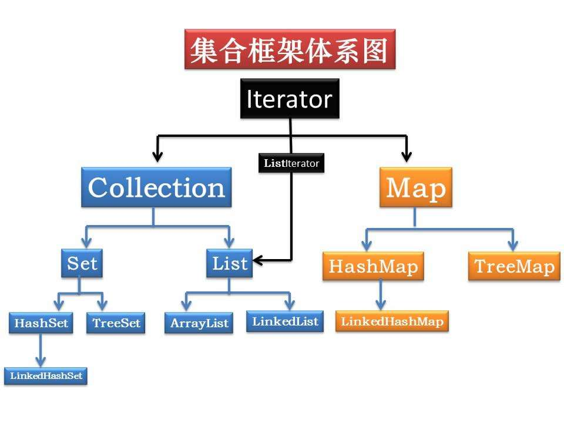
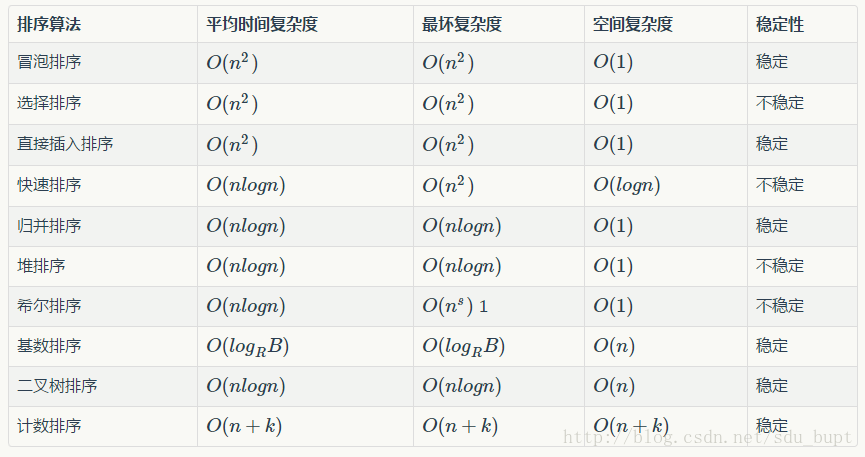
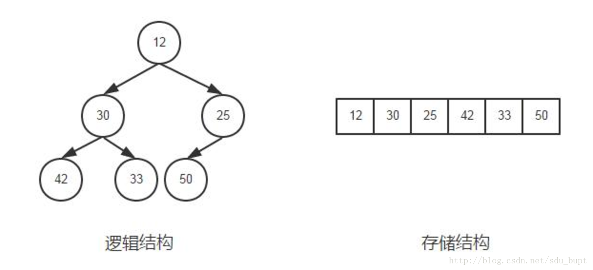

### 1、集合框架

#### 1、集合框架结构，数组与集合的关系？

 

数组：是用来存现对象的一种容器，**可以存储基本数据类型**，但是数组的**长度固定**，不适合在对象数量未知的情况下使用。

集合：**只能存储对象**，且对象类型可以不一样，**长度可变**，可在多数情况下使用。容器类仅能维持对象引用，而不是将对象信息复制一份至数列某位置。

**主要接口区别**

> 1、List（**有序、可重复**，**查询快，插入删除慢**）
> List里存放的对象是有序的，同时也是可以重复的，**List关注的是索引**，拥有一系列和索引相关的方法，查询速度快。因为往list集合里插入或删除数据时，会伴随着后面数据的移动，所以插入删除数据速度慢。
>
> 2、Set（**无序、不能重复**）
> Set里存放的对象是无序，不能重复的，集合中的对象不按特定的方式排序，只是简单地把对象加入集合中。
>
> 3、Map（**键值对、键唯一、值不唯一**）
> Map集合中存储的是键值对，键不能重复，值可以重复。根据键得到值，对map集合遍历时先得到键的set集合，对set集合进行遍历，得到相应的值。

**LinkedList类** 、**ArrayList类** 、**Vector类** 

> - linkedList没有同步方法。如果多个线程同时访问一个List，则必须自己实现访问同步 。（**查询慢，增删快**，底层是实现是链表）
> - ArrayList也是非同步的,允许null,基于索引，内部由一个数组支持。（**查询快，增删慢**，底层实现是数组）
> - Vector类似ArrayList，但是**Vector是同步的**。由Vector创建的Iterator ，当一个Iterator被创建而且正在被使用，另一个线程改变了Vector的状态（例如，添加或删除了一些元素），这时调用Iterator的方法时将抛出ConcurrentModificationException，因此必须捕获该异常。 
> - Stack继承自Vector，实现一个后进先出的堆栈。 

**HashTable、HashMap、TreeMap、HashTree、ConcurrentHashMap**

> HashMap和Hashtable类似，不同之处在于**HashMap是非同步的，并且允许null，即null value和null key。** 
>
> HashTable**通过synchronized修饰方法**的方式来实现多线程同步，它的同步会锁住整个数组，高并发情况下性能极差。
>
> 在Map中**插入、删除和定位元素**这类操作，HashMap是最好的选择。然而。假如你须要对一个**有序的key集合进行遍历**，TreeMap是更好的选择。**HashTree用于维护其内元素的总排序状态**。 

> **ConcurrentHashMap**：在线程安全的基础上提供了更好的写并发能力，但同时降低了对读一致性的要求 ，设计上大量的利用了volatile，final，CAS等lock-free技术来减少锁竞争对于性能的影响。
>
> ​	采用**分段锁**的设计，只有在**同一个分段内才存在竞态关系，不同的分段锁之间没有锁竞争**。相比于对整个**Map加锁**的设计，分段锁大大的提高了高并发环境下的处理能力。但同时，由于不是对整个Map加锁，导致一些需要扫描整个Map的方法（如size(), containsValue()）需要使用特殊的实现，另外一些方法（如clear()）甚至放弃了对一致性的要求，所以是**弱一致性的**。

###  2、排序算法

#### 1、算法复杂度及稳定性

> 稳定的排序算法是：冒泡排序，直接插入排序，归并排序，基数排序，二叉树排序，计数排序。  
>
> 不稳定的排序算法：选择排序，快速排序，堆排序，希尔排序。 
>
> 面试中常见的算法： **快速排序>归并排序>堆排序>冒泡>插入>选择**

#### 2、常用排序算法实现

##### 1、快排

> ​	快速排序是目前在实践中非常高效的一种排序算法，它**不是稳定**的排序算法，平均时间复杂度为O(nlogn)，最差情况下复杂度为O(n^2)。
>
> **基本思想**：通过一趟排序将要排序的数据分割成独立的两部分，其中一部分的所有数据都比另外一部分的所有数据都要小，然后再按此方法对这两部分数据分别进行快速排序，整个排序过程可以**递归**进行，以此达到整个数据变成有序序列。 

##### 2、归并排序

> ​	归并排序是**稳定**的排序算法，其时间复杂度为O(nlogn)，如果是使用链表的实现的话，空间复杂度可以达到O(1)，但如果是使用数组来存储数据的话，在归并的过程中，需要临时空间来存储归并好的数据，所以空间复杂度为O(n)。
>
> **工作原理**（假设序列共有n个元素）：将序列每相邻两个数字进行归并操作（merge)，形成floor(n/2)个序列，排序后每个序列包含两个元素
>
> 将上述序列再次归并，形成floor(n/4)个序列，每个序列包含四个元素
>
> 重复步骤2，直到所有元素排序完毕。

#####  3、堆排序

**二叉堆**是完全二叉树或者近似完全二叉树，满足两个特性 

> 1. 父结点的键值总是大于或等于(小于或等于)任何一个子节点的键值 
> 2. 每个结点的左子树和右子树都是一个二叉堆

当父结点的键值总是大于或等于任何一个子节点的键值时为**最大堆**。当父结点的键值总是小于或等于任何一个子节点的键值时为**最小堆**。一般二叉树简称为堆。

​	一般都是数组来存储堆，i结点的父结点下标就为(i – 1) / 2。它的左右子结点下标分别为2 * i + 1和2 * i + 2。如第0个结点左右子结点下标分别为1和2。存储结构如图所示：

> 算法原理 
>
> 1. 先将初始数据R[1..n]建成一个最大堆，此堆为初始的无序区
> 2. 再将关键字最大的记录R[1]（即堆顶）和无序区的最后一个记录
> 3. R[n]交换，由此得到新的无序区R[1..n-1]和有序区R[n]，且满足R[1..n-1].keys≤R[n].key
> 4. 由于交换后新的根R[1]可能违反堆性质，故应将当前无序区R[1..n-1]调整为堆。
> 5. 重复2、3步骤，直到无序区只有一个元素为止。

