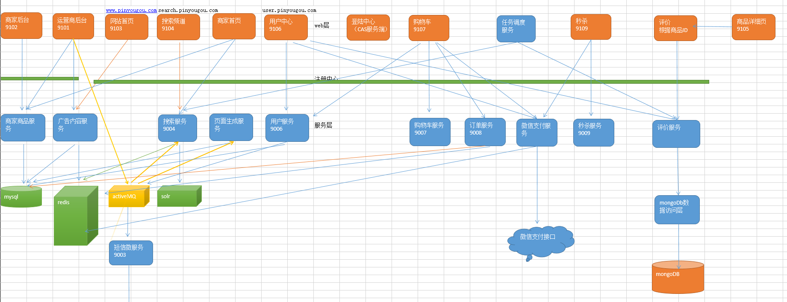
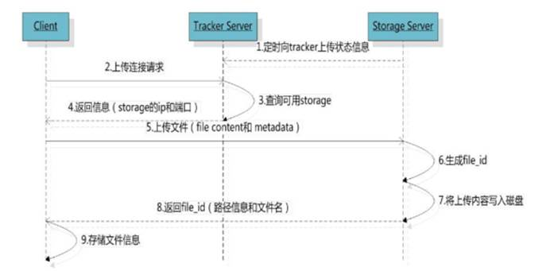
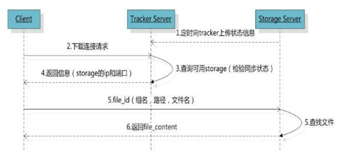
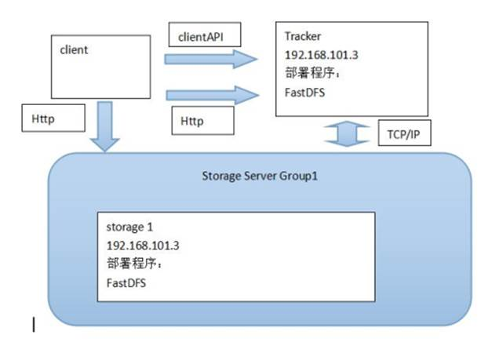
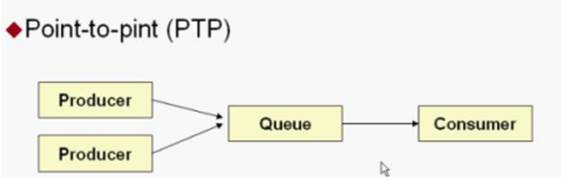
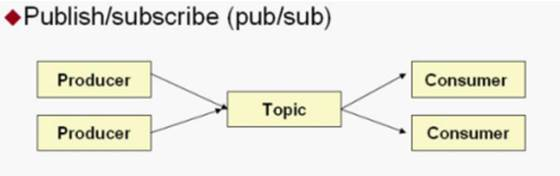
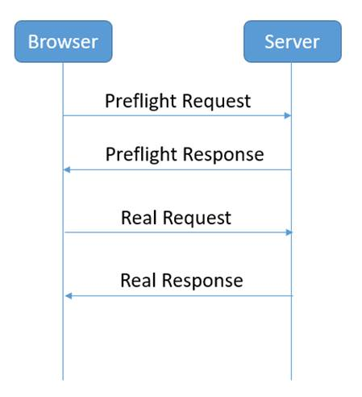
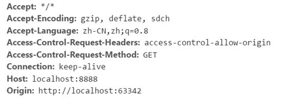

####  1、项目介绍

> ​	Eshop在线云商是一个大型[B2B2C](https://www.baidu.com/s?wd=B2B2C&tn=44039180_cpr&fenlei=mv6quAkxTZn0IZRqIHckPjm4nH00T1dWuynvmWw-n10znjIhmWPB0ZwV5Hcvrjm3rH6sPfKWUMw85HfYnjn4nH6sgvPsT6KdThsqpZwYTjCEQLGCpyw9Uz4Bmy-bIi4WUvYETgN-TLwGUv3En10zPW6dnHf4)平台。平台包括运营商后台、商家管理后台和前台系统。网站采用商家入驻的模式，商家入驻平台提交申请，由平台进行资质审核，审核通过后，商家拥有独立的管理后台录入商品信息，商品经过平台审核后即可发布。
>
> ​	网站采用分布式服务架构（RPC），通过Dubbx进行服务治理，从上往下，反向代理层使用nginx集群，前端采用angular.js实现数据的双向绑定，应用层用的是springmvc。网站前台、SSO系统、搜索系统、购物车系统、订单系统、会员系统、评价系统和秒杀系统等模块。
>
> ​	数据缓存层采用redis做系统缓存，比如商品详情页。
>
> ​	电商系统有大量的图片，所以采用了单独的文件服务器fastDFS
>
> ​	数据-数据库层采用中间件Mycat实现数据库分库分表和读写分离，缓解数据库压力。
>
> ​	系统各模块之间的通信采用ActiveMQ消息队列，实现索引库同步，缓存同步等系统通信。

#### 1、集群、分布式等概念

#### 2、微信支付

​	配置appid，商户账号、商户秘钥、回调地址，通过HttpClient工具类实现对远程支付接口的调用。“统一下单”API, 构建参数发送给统一下单的url ，返回的信息中有支付url，根据url生成二维码，显示的订单号和金额也在返回的信息中。

订单号通过分布式ID生成器生成 ，开发结束后对接业务系统的订单号和金额。

​	检测支付状态**：“查询订单”API, 我们在controller方法中**轮询调用查询订单（**间隔3秒），当返回状态为success时，我们会在controller方法返回结果。前端代码收到结果后跳转到成功页面。 

​	二维码页面一直未支付，或是关掉了支付页面，我们的代码会一直循环调用微信接口，这样会对程序造成很大的压力。所以我们要加一个时间限制或是循环次数限制，当超过时间或次数时，跳出循环。

> （1）在用户下订单时，判断如果为微信支付，就想支付日志表添加一条记录，信息包括支付总金额、订单ID（多个）、用户ID 、下单时间等信息，支付状态为0（未支付）
>
> （2）生成的**支付日志对象放入redis**中，以用户ID作为key，这样在生成支付二维码时就可以从redis中提取支付日志对象中的金额和订单号。
>
> （3）当用户支付成功后，修改支付日志的支付状态为1
>
> （已支付），并记录微信传递给我们的交易流水号。根据订单
>
> ID（多个）修改订单的状态为2（已付款）

**支付金额的数据类型：**

​	MySQL中存在float,double等非标准数据类型，也有decimal这种标准数据类型。

其区别在于，**float，double等非标准类型，在DB中保存的是近似值，而Decimal则以字符串的形式保存数值。**
	float，double类型是可以存浮点数，但是float有个坏处，当你给定的数据是整数的时候，那么它就以整数给你处理。这样我们在存取货币值的时候自然遇到问题，我的default值为：0.00而实际存储是0，同样我存取货币为12.00，实际存储是12。
	mysql提供了两个数据类型：decimal，这种数据类型可以轻松解决上面的问题：decimal类型被 MySQL 以同样的类型实现，这在 SQL92 标准中是允许的。他们用于保存对准确精度有重要要求的值，例如与金钱有关的数据。

#### 3、秒杀系统

难点：库存只有一份，**所有人都在同一时间读写一个数据，读写冲突，锁非常严重。**

优化方向：

> 1. 将请求尽量拦截在上游，不要让锁冲突落到数据库上。
> 2. 充分利用缓存，在读多写少的业务场景下，非常适合用缓存做优化
>
> **客户端层优化：**
>
> - 产品层面：用户点查询或购票后，按钮置灰，禁止重复提交。
> - Js层面：限制用户x秒以内只能提交一次请求。
>
> **站点层的请求拦截：**
>
> 对uid进行计数和去重，做限速，做页面缓存
>
> **服务层：**
>
> ​	按照业务写请求队列控制流量，做数据缓存。（每次只透露有限个写请求去数据层，读请求用redis来抗，数据细粒度的优化（做粗粒度的缓存，有票还是无票））

> ​	运用缓存减少数据库瞬间的访问压力！**读取商品详细信息时运用缓存，当用户点击抢购时减少缓存中的库存数量，当库存数为0时或活动期结束时，同步到数据库。 产生的秒杀预订单也不会立刻写到数据库中，而是先写到缓存，当用户付款成功后再写入数据库。**

秒杀倒计时效果：

>  在AngularJS中$interval服务用来处理间歇性处理一些事情 

秒杀下单：

> 商品详细页点击立即抢购实现秒杀下单，下单时扣减库存。当库存为0或不在活动期范围内时无法秒杀。 "

订单超时：

> 用户下单后5分钟尚未付款应该释放订单，增加库存 ，关闭微信订单

#### 4、单点登录

​	我们目前的系统存在诸多子系统，而这些子系统是分别部署在不同的服务器中，那么使用传统方式的session是无法解决的，我们需要使用相关的单点登录技术来解决。

**集群环境下，应用同时部署在几台服务器上，session都是不一样的，出现多次要求用户登录。单点登录系统是使用redis模拟Session，实现Session的统一管理。解决分布式环境中，Session共享问题**。 

##### 1、Redis模拟Session(Token机制)

 

登录的处理流程：

1、登录页面提交用户名密码。

2、登录成功后生成token。Token相当于原来的jsessionid，字符串，可以使用uuid。

3、把用户信息保存到redis。Key就是token，value就是TbUser对象转换成json。

4、使用String类型保存Session信息。可以使用“前缀:token”为key

5、设置key的过期时间。模拟Session的过期时间。一般半个小时。

6、把token写入cookie中。

7、Cookie需要跨域。例如www.e3.com\sso.e3.com\order.e3.com，可以使用工具类。

8、Cookie的有效期。关闭浏览器失效。

9、登录成功。

##### 2、CAS单点登录系统

​	CAS 包含两个部分： CAS Server 和 CAS Client。CAS Server 需要独立部署，主要负责对用户的认证工作；CAS Client 负责处理对客户端受保护资源的访问请求，需要登录时，重定向到 CAS Server。下图是 CAS 最基本的协议过程：

SSO单点登录访问流程主要有以下步骤：

1. 访问服务：SSO客户端发送请求访问应用系统提供的服务资源。
2. 定向认证：SSO客户端会重定向用户请求到SSO服务器。
3. 用户认证：用户身份认证。
4. 发放票据：SSO服务器会产生一个随机的Service Ticket。
5. 验证票据：SSO服务器验证票据Service Ticket的合法性，验证通过后，允许客户端访问服务。
6. 传输用户信息：SSO服务器验证票据通过后，传输用户认证结果信息给客户端。

##### 3、跨域问题

#### 5、购物车系统

> 当用户在未登录的情况下，将此购物车存入cookies , 在用户登陆的情况下，将购物车数据存入redis  。如果用户登陆时，cookies中存在购物车，需要将cookies的购物车合并到redis中存储,并清除cookie

#### 6、FastDfs

​	FastDFS架构包括 Tracker server和Storage server。**客户端请求Tracker server进行文件上传、下载，通过Tracker server调度最终由Storage server完成文件上传和下载**。

​       Tracker server作用是负载均衡和调度，通过Tracker server**在文件上传时可以根据一些策略找到Storage server提供文件上传服务**。可以将tracker称为追踪服务器或调度服务器。

​       Storage server作用是文件存储，客户端上传的文件最终存储在Storage服务器上，**Storage server没有实现自己的文件系统而是利用操作系统 的文件系统来管理文件**。可以将storage称为存储服务器。

 

服务端两个角色：

Tracker：管理集群，tracker也可以实现集群。每个tracker节点地位平等，收集Storage集群的状态。

Storage：实际保存文件，Storage分为多个组，每个组之间保存的文件是不同的。每个组内部可以有多个成员，组成员内部保存的内容是一样的，组成员的地位是一致的，没有主从的概念。

#####  1、文件上传流程

客户端上传文件后存储服务器将文件 ID 返回给客户端，此文件 ID 用于以后访问该文件的索引信息。文件索引信息包括：组名，虚拟磁盘路径，数据两级目录，文件名。

**组名**：文件上传后所在的 storage 组名称，在文件上传成功后有 storage 服务器返回，需要客户端自行保存。

**虚拟磁盘路径**：storage 配置的虚拟路径，与磁盘选项 store_path*对应。如果配置了

store_path0 则是 M00，如果配置了 store_path1 则是 M01，以此类推。

 **数据两级目录**：storage 服务器在每个虚拟磁盘路径下创建的两级目录，用于存储数据

文件。

**文件名**：与文件上传时不同。是由存储服务器根据特定信息生成，文件名包含：源存储

服务器 IP 地址、文件创建时间戳、文件大小、随机数和文件拓展名等信息。

##### 2、文件下载流程

 

##### 3、最简单的 FastDFS 架构

#### 7、nginx

> 1、http服务器。Nginx是一个http服务可以独立提供http服务，可以做网页静态服务器。
>
> 2、虚拟主机。可以实现在一台服务器虚拟出多个网站。例如个人网站使用的虚拟主机。
>
> 3、反向代理，**负载均衡**。当网站的访问量达到一定程度后，单台服务器不能满足用户的请求时，需要用多台服务器集群可以使用nginx做反向代理,并且多台服务器可以平均分担负载，不会因为某台服务器负载高宕机而某台服务器闲置的情况。

#####  1.1. 什么是反向代理

正向代理

 

反向代理：

 

 

反向代理服务器决定哪台服务器提供服务。返回代理服务器不提供服务器。也是请求的转发。

##### 1.2. Nginx实现反向代理

两个域名指向同一台nginx服务器，**用户访问不同的域名显示不同的网页内容**。

两个域名是www.sian.com.cn和www.sohu.com

nginx服务器使用虚拟机192.168.101.3 

 

第一步：安装两个tomcat，分别运行在8080和8081端口。

第二步：启动两个tomcat。

第三步：反向代理服务器的配置

第四步：nginx重新加载配置文件

第五步：配置域名

在hosts文件中添加域名和ip的映射关系

192.168.25.148 www.sina.com.cn

192.168.25.148 www.sohu.com

#### 8、dubbo

Dubbox 致力于提供高性能和透明化的RPC远程服务调用方案，以及SOA服务治理方案。简单的说，dubbox就是个服务框架，并且本质上是个**远程服务调用的分布式框架**。

**节点角色说明：**

 Provider: 暴露服务的服务提供方。

 Consumer: 调用远程服务的服务消费方。

Registry: 服务注册与发现的注册中心。

Monitor: 统计服务的调用次调和调用时间的监控中心。

Container: 服务运行容器。

**调用关系说明：**

0. 服务容器负责启动，加载，运行服务提供者。
1. 服务提供者在启动时，向注册中心注册自己提供的服务。
2. 服务消费者在启动时，向注册中心订阅自己所需的服务。
3. 注册中心返回服务提供者地址列表给消费者，如果有变更，注册中心将基于长连接推

送变更数据给消费者。

4. 服务消费者，从提供者地址列表中，基于软负载均衡算法，选一台提供者进行调用，

如果调用失败，再选另一台调用。

5. 服务消费者和提供者，在内存中累计调用次数和调用时间，定时每分钟发送一次统计

数据到监控中心。

####9、搜索系统

​	SolrCloud是基于Solr和Zookeeper的分布式搜索方案，它的主要思想是**使用Zookeeper作为集群的配置信息中心**。当你需要大规模、容错、布式索引和检索能力时使用 SolrCloud。当一个系统的索引量很大，**搜索请求并发很高**，这时需要使用SolrCloud来满足这些需求。它有几个特色功能：

- 集中式的配置信息
- 自动容错
- 近实时搜索
- 查询时自动负载均衡

#####  1.   Solr集群的系统架构

######  1.1. 物理结构

三个Solr实例（ **每个实例包括两个Core**），组成一个SolrCloud。

###### 1.2 逻辑结构

​	索引集合包括两个Shard（shard1和shard2），shard1和shard2分别由三个Core组成，其中一个Leader两个Replication，Leader是由zookeeper选举产生，zookeeper控制每个shard上三个Core的索引数据一致，解决高可用问题。用户发起索引请求分别从shard1和shard2上获取，解决高并发问题。

>  **collection**：
>
> ​	Collection在SolrCloud集群中是一个逻辑意义上的完整的索引结构。它常常被划分为一个或多个Shard（分片），它们使用相同的配置信息。比如：针对商品信息搜索可以创建一个collection。collection=shard1+shard2+....+shardX
>
>  **Core**：
>
> ​	每个Core是Solr中一个独立运行单位，提供 索引和搜索服务。一个shard需要由一个Core或多个Core组成。由于collection由多个shard组成所以collection一般由多个core组成。
>
> **Master或Slav**：
>
> ​	Master是master-slave结构中的主结点（通常说主服务器），Slave是master-slave结构中的从结点（通常说从服务器或备服务器）。同一个Shard下master和slave存储的数据是一致的，这是为了达到高可用目的。
>
>  **Shard**：
>
> ​	Collection的逻辑分片。每个Shard被化成一个或者多个replication，通过选举确定哪个是Leader。

 

 

######   1.3. 需要实现的solr集群架构

Zookeeper作为集群的管理工具。

> 1、集群管理：容错、负载均衡。
>
> 2、配置文件的集中管理
>
> 3、集群的入口

> 需要实现zookeeper 高可用。需要搭建集群。建议是奇数节点。需要三个zookeeper服务器。搭建solr集群需要7台服务器。搭建伪分布式：需要三个zookeeper节点,需要四个tomcat节点。

#### 10、redis

##### 1、5种数据类型、常见操作命令

string、set、list、hash、集合

#####2、redis的持久化方案

Redis的所有数据都是保存到内存中的。

Rdb：快照形式，**定期把内存中当前时刻的数据保存到磁盘**，Redis默认支持的持久化方案。

aof形式：append only file**，把所有对redis数据库操作的命令，增删改操作的命令保存到文件中**。数据库恢复时把所有的命令执行一遍即可。

##### 3、 redis-cluster架构

**redis-cluster投票:容错**

架构细节:

(1)所有的redis节点彼此互联**(PING-PONG机制)**,内部使用二进制协议优化传输速度和带宽.

(2)节点的fail是通过集群中**超过半数的节点检测失效**时才生效.

(3)客户端与redis节点直连,不需要中间proxy层.客户端不需要连接集群所有节点,连接集群中任何一个可用节点即可

(4)redis-cluster把**所有的物理节点映射到[0-16383]slot上**,cluster 负责维护node<->slot<->value

Redis 集群中内置了 16384 个哈希槽，当需要在 Redis 集群中放置一个 key-value 时，redis 先对 key 使用 crc16 算法算出一个结果，然后把结果对 16384 求余数，这样每个 key 都会对应一个编号在 0-16383 之间的哈希槽，redis 会根据节点数量大致均等的将哈希槽映射到不同的节点。

|      |                                                              |
| ---- | ------------------------------------------------------------ |
|      |  |

​	Redis集群中至少应该有三个节点。要保证集群的高可用，需要每个节点有一个备份机。

Redis集群至少需要6台服务器。

4、哪些地方用到了redis

#### 11	消息机制（MQ）

##### 1、JMS规范与消息

​	JMS（Java Messaging Service）是Java平台上有关面向消息中间件的技术规范，它便于消息系统中的Java应用程序进行消息交换,并且通过提供标准的产生、发送、接收消息的接口简化企业应用的开发。JMS本身只定义了一系列的**接口规范**，是一种与厂商无关的 API，用来访问消息收发系统。它类似于 JDBC：这里，MS 则提供同样与厂商无关的访问方法，以访问消息收发服务。

​	消息是 JMS 中的一种类型对象，由两部分组成：报头和消息主体。报头由路由信息以及有关该消息的元数据组成。消息主体则携带着应用程序的数据或有效负载。

**JMS 定义了五种不同的消息正文格式**，以及调用的消息类型，允许你发送并接收以一

些不同形式的数据，提供现有消息格式的一些级别的兼容性。

- TextMessage--一个字符串对象
- MapMessage--一套名称-值对
- ObjectMessage--一个序列化的 Java 对象
- BytesMessage--一个字节的数据流
- StreamMessage -- Java 原始值的数据流

##### 2、JMS消息传递类型

对于消息的传递有两种类型：

**点对点**，即一个生产者和一个消费者一一对应；

**发布/ 订阅模式**，一个生产者产生消息并进行发送后，可以由多个消费者进

行接收。

​    

#####  3、项目应用

运用消息中间件activeMQ实现运营商后台与搜索服务的零耦合。运营商执行商品审核后，向activeMQ发送消息（SKU列表），搜索服务从activeMQ接收到消息并导入到solr索引库。 

#### 	12、SpringSecurity

​	Spring Security是一个能够为基于Spring的企业应用系统提供声明式的安全访问控制解决方案的安全框架。它提供了一组可以在Spring应用上下文中配置的Bean，充分利用了Spring IoC，DI（控制反转Inversion of Control ,DI:Dependency Injection 依赖注入）和AOP（面向切面编程）功能，为应用系统提供声明式的安全访问控制功能，减少了为企业系统安全控制编写大量重复代码的工作。

#### 13、跨域解决方案

##### 1、跨域解决方案CORS

​	CORS是一个W3C标准，全称是"跨域资源共享"（Cross-origin resource sharing）需要浏览器和服务器同时支持。它允许浏览器向跨源服务器，发出XMLHttpRequest请求，从而**克服了AJAX只能同源使用**的限制。整个CORS通信过程，都是浏览器自动完成，不需要用户参与。对于开发者来说，CORS通信与同源的AJAX通信没有差别，代码完全一样。浏览器一旦发现AJAX请求跨源，就会自动添加一些附加的头信息，有时还会多出一次附加的请求，但用户不会有感觉。因此，**实现CORS通信的关键是服务器。只要服务器实现了CORS接口，就可以跨源通信。**

请求过程如下图:

Preflight Request：

然后服务器端给我们返回一个Preflight Response，**Access-Control-Allow-Origin**

Access-Control-Allow-Origin是**HTML5**中定义的一种解决资源跨域的策略。

他是通过服务器端返回带有Access-Control-Allow-Origin标识的Response header，用来解决资源的跨域权限问题。CORS请求默认不发送Cookie和HTTP认证信息。如果要把Cookie发到服务器，一方面要服务器同意，指定Access-Control-Allow-Credentials字段。另一方面，开发者必须在AJAX请求中打开withCredentials属性。否则，即使服务器同意发送Cookie，浏览器也不会发送。或者，服务器要求设置Cookie，浏览器也不会处理。

#### 14、分布式事务

（跨数据库，同时往几个数据库中写数据并且在一个事务中完成）

​	互联网项目中需要快速响应用户！使用MQ实现数据的最终一致性，而不是实时一致。手动应答模式，消息处理完了才给回馈，直到消息消费完才结束。可以保证事务的**最终一致性**。没人会用分布式事务。

#### 15、短信微服务

申请签名—申请模板—创建accessKey

接收activeMQ的消息（MAP类型）  消息包括手机号（mobile）、短信模板号（template_code）、签名（sign_name）、参数字符串（param ） 。

